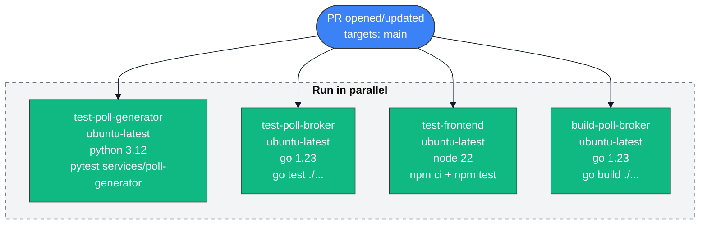
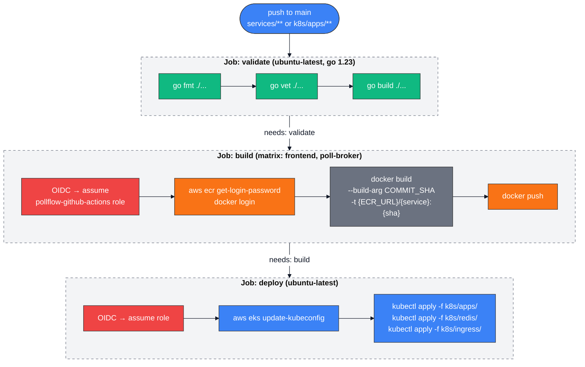
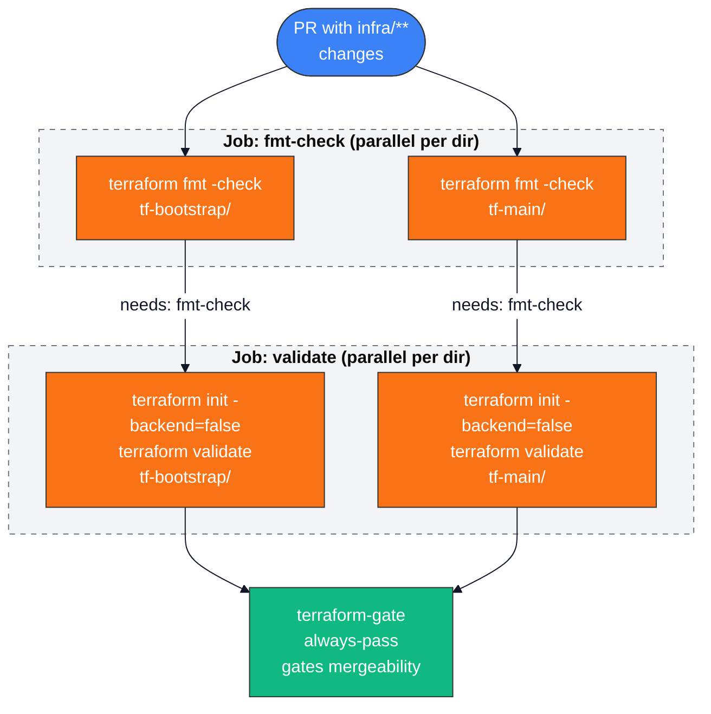

# CI/CD Workflow Diagrams

## test.yml: Unit & Integration Tests (PR → main)

## build-and-deploy.yml: Build & Deploy (push → main)

## terraform.yml: Infrastructure Validation (PR with infra/** changes)

