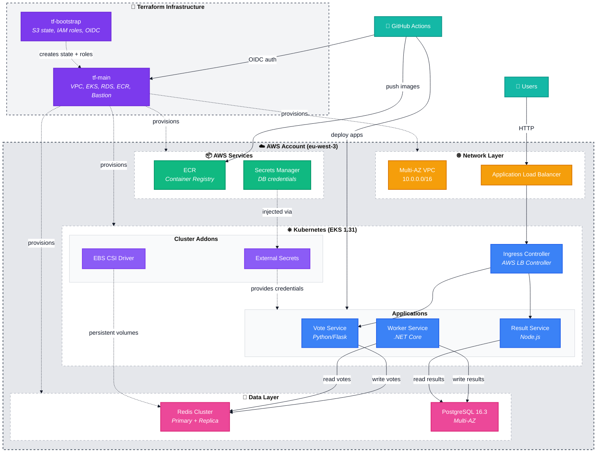

# Pollflow

A cloud-native microservices voting application deployed on AWS EKS, demonstrating modern infrastructure as code, Kubernetes orchestration, and secure CI/CD practices.

## Summary

Pollflow is an educational project showcasing end-to-end cloud infrastructure deployment using Terraform and Kubernetes. The application allows users to vote between two options, with votes processed asynchronously and results displayed in real-time.

**Key Features:**
- **Infrastructure as Code**: Complete AWS infrastructure managed with Terraform (VPC, EKS, RDS, ECR)
- **Microservices Architecture**: Three containerized services (vote, worker, result) deployed on Kubernetes
- **Secure by Design**: IAM roles with AssumeRole pattern, IRSA for pod-level permissions, no static credentials
- **Automated CI/CD**: GitHub Actions with OIDC federation for credential-less deployments
- **Production Patterns**: Multi-AZ RDS, Redis primary-replica cluster, horizontal pod autoscaling, ingress with ALB

**Technology Stack:**
- **Cloud**: AWS (EKS, RDS PostgreSQL, ECR, S3, Secrets Manager)
- **Infrastructure**: Terraform >= 1.9, remote S3 state with native locking
- **Container Orchestration**: Kubernetes 1.31 (managed EKS)
- **Applications**: Python/Flask (vote), .NET Core (worker), Node.js (result)
- **Data Layer**: Redis cluster, PostgreSQL 16.3 Multi-AZ

## Architecture Overview



**Color Legend:**
- 🟦 **Users & CI/CD**: External actors
- 🟣 **Terraform**: Infrastructure provisioning
- 🟡 **Network**: Load balancing and routing
- 🔵 **Applications**: Microservices
- 🟣 **Addons**: Kubernetes operators
- 🩷 **Data**: Persistent storage
- 🟢 **AWS Services**: Container registry and secrets

## Project Structure

```
pollflow/
├── infra/
│   ├── tf-bootstrap/       # One-time AWS setup (S3 state, IAM, OIDC)
│   ├── tf-main/            # Main infrastructure (VPC, EKS, RDS, ECR)
│   └── scripts/            # Helper scripts
├── k8s/                    # Kubernetes manifests
│   ├── apps/               # Application deployments
│   ├── redis/              # Redis cluster
│   ├── secrets/            # External Secrets config
│   ├── ingress/            # ALB ingress rules
│   └── storage/            # StorageClass definitions
├── services/               # Application source code
│   ├── vote/               # Python voting frontend
│   ├── worker/             # .NET vote processor
│   └── result/             # Node.js results viewer
└── scripts/                # Project automation
```

## Quick Start

### Local Development (Docker Compose)

Run the complete application stack locally for development and testing:

```bash
# 1. Start all services (PostgreSQL, Redis, poll-broker, frontend)
make docker-up

# 2. View logs
make docker-logs              # All services
make docker-logs-frontend     # Frontend only
make docker-logs-broker       # Poll broker only

# 3. Access the application
open http://localhost:3000    # Frontend web interface

# 4. Stop services
make docker-down

# 5. Clean up (removes volumes and images)
make docker-clean
```

**Available services:**
- **Frontend**: http://localhost:3000 (SvelteKit web app)
- **PostgreSQL**: localhost:5432 (pollflow_development database)
- **Redis**: localhost:6379 (queue and pub/sub)
- **Poll Broker**: Background worker processing votes

**Environment Configuration:**
Edit `.development.env` to customize database credentials, ports, and other settings.

See [services/frontend/README.md](services/frontend/README.md) for frontend-specific development.

---

### 1. Bootstrap AWS Infrastructure

```bash
cd infra/tf-bootstrap

# Configure variables
cp terraform.tfvars.example terraform.tfvars
# Edit terraform.tfvars with your AWS region and project settings

# Deploy bootstrap
terraform init
terraform apply

# Backup the state file
cp terraform.tfstate ~/pollflow-bootstrap.tfstate.backup
```

See [tf-bootstrap/README.md](infra/tf-bootstrap/README.md) for detailed setup.

### 2. Deploy Main Infrastructure

```bash
cd ../tf-main

# Initialize with remote state
terraform init

# Deploy infrastructure
terraform plan
terraform apply  # Takes ~15-20 minutes for EKS cluster
```

See [tf-main/README.md](infra/tf-main/README.md) for module details and configuration.

### 3. Deploy Applications

```bash
# Configure kubectl
aws eks update-kubeconfig --name pollflow-eks-cluster --region eu-west-3

# Apply Kubernetes manifests
kubectl apply -f k8s/storage/
kubectl apply -f k8s/redis/
kubectl apply -f k8s/secrets/
kubectl apply -f k8s/apps/
kubectl apply -f k8s/ingress/

# Verify deployment
kubectl get pods -A
kubectl get ingress
```

See [k8s/README.md](k8s/README.md) for Kubernetes architecture and troubleshooting.

## Component Documentation

Each major component has detailed documentation:

- **[Bootstrap Setup](infra/tf-bootstrap/README.md)**: S3 state backend, IAM roles, GitHub OIDC integration
- **[Infrastructure](infra/tf-main/README.md)**: Network, compute, data layer, security architecture
- **[Kubernetes](k8s/README.md)**: Application deployments, storage, secrets, ingress configuration
- **[Services](services/README.md)**: Application source code and Dockerfiles

## Security Features

- **No Static Credentials**: All access via IAM role assumption with temporary tokens
- **IRSA**: Pod-level IAM permissions for External Secrets Operator
- **OIDC Federation**: GitHub Actions authenticate without storing AWS keys
- **External ID**: Role assumption requires shared secret validation
- **Secrets Manager**: Database credentials injected at runtime
- **Network Isolation**: Private subnets for compute, public only for load balancers
- **Multi-AZ**: High availability for databases and compute

## Cost Estimation

Approximate monthly cost (AWS eu-west-3):
- **EKS Cluster**: $73 (control plane)
- **EC2 Nodes**: $30-60 (t3.small, 1-3 nodes)
- **RDS**: $15 (db.t3.micro Multi-AZ)
- **NAT Gateways**: $32 (2x Multi-AZ)
- **S3/Secrets**: <$5
- **Total**: ~$150-180/month

> **Tip**: Destroy when not in use: `terraform destroy` in tf-main saves ~$140/month

## Learning Objectives

This project demonstrates:
- ✅ Terraform module design and state management
- ✅ EKS cluster deployment with managed node groups
- ✅ Kubernetes StatefulSets, Deployments, Services, Ingress
- ✅ IAM roles with AssumeRole pattern and IRSA
- ✅ Multi-AZ architecture for high availability
- ✅ External Secrets Operator integration
- ✅ AWS Load Balancer Controller
- ✅ Container registry management with ECR
- ✅ CI/CD with GitHub Actions OIDC
- ✅ Zero-downtime deployments and rolling updates

## Requirements

- **Terraform**: >= 1.9 (for S3 native state locking)
- **AWS CLI**: >= 2.0
- **kubectl**: >= 1.28
- **Docker**: >= 20.10 (for building images)
- **AWS Account**: With admin access for bootstrap
- **GitHub**: For CI/CD integration (optional)

## Cleanup

To avoid ongoing AWS charges:

```bash
# 1. Delete Kubernetes resources (removes ALBs)
kubectl delete -f k8s/ingress/
kubectl delete -f k8s/apps/
kubectl delete -f k8s/redis/
kubectl delete pvc --all

# 2. Destroy main infrastructure
cd infra/tf-main
terraform destroy  # Confirms before deletion

# 3. Optionally destroy bootstrap (removes state backend)
cd ../tf-bootstrap
terraform destroy
```
