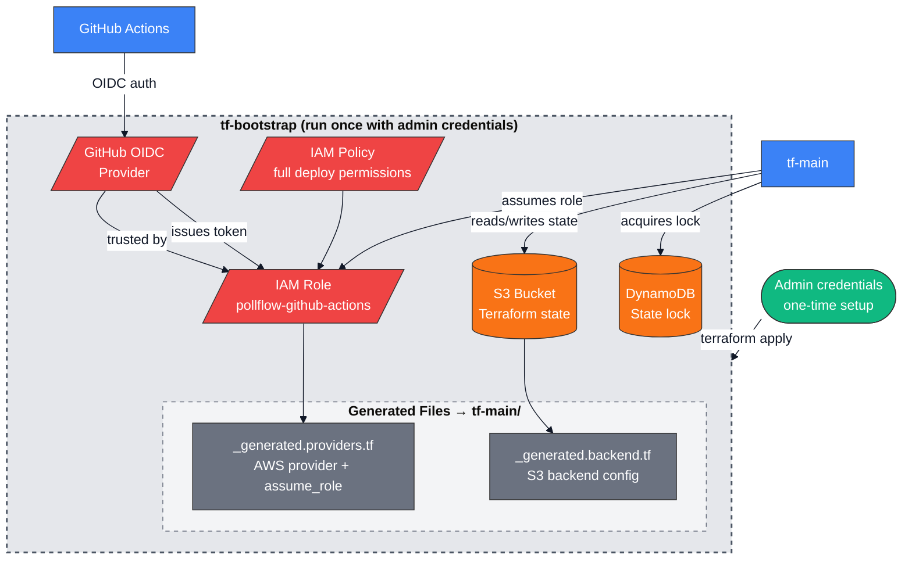
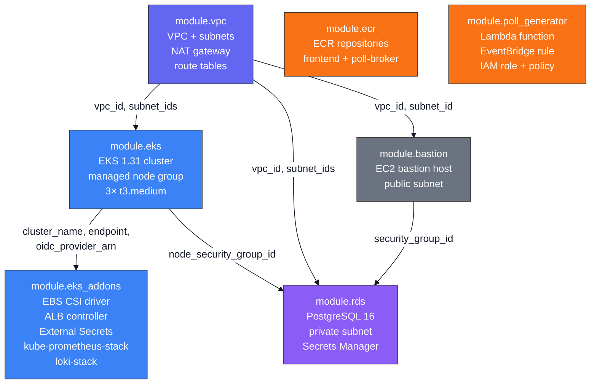
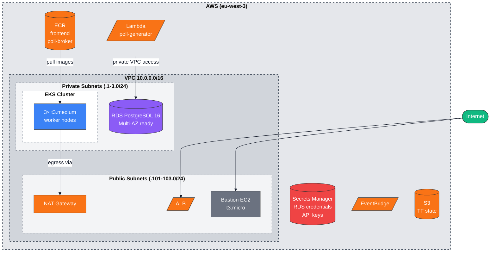

# Infrastructure Diagrams

## tf-bootstrap: Foundation Resources

```mermaid
%%{init: {'theme':'base', 'themeVariables': { 'primaryColor':'#e5e7eb','primaryTextColor':'#111827','primaryBorderColor':'#9ca3af','lineColor':'#111827','secondaryColor':'#d1d5db','tertiaryColor':'#f3f4f6','edgeLabelBackground':'#ffffff','mainBkg':'#f5f5f4','nodeBorder':'#9ca3af','background':'#f5f5f4','clusterBkg':'transparent'},'themeCSS':'.node rect, .node circle, .node ellipse, .node polygon, .node path { filter: none !important; box-shadow: none !important; } .cluster rect { filter: none !important; box-shadow: none !important; } svg { background-color: #f5f5f4 !important; } .cluster-label { background-color: #ffffff !important; padding: 6px 12px !important; border-radius: 4px !important; font-size: 16px !important; font-weight: 700 !important; box-shadow: 0 1px 3px rgba(0,0,0,0.12) !important; border: 1px solid #d1d5db !important; } .edgePath, .edgePath path, .flowchart-link { z-index: 1 !important; }'}}%%

graph TB
    subgraph Bootstrap["tf-bootstrap (run once with admin credentials)"]
        S3[(S3 Bucket\nTerraform state)]
        DDB[(DynamoDB\nState lock)]
        OIDC[/GitHub OIDC\nProvider/]
        IAMRole[/IAM Role\npollflow-github-actions/]
        IAMPolicy[/IAM Policy\nfull deploy permissions/]

        subgraph Generated["Generated Files → tf-main/"]
            BackendTF[_generated.backend.tf\nS3 backend config]
            ProvidersTF[_generated.providers.tf\nAWS provider + assume_role]
        end
    end

    Admin([Admin credentials\none-time setup]) -->|terraform apply| Bootstrap
    IAMPolicy --> IAMRole
    OIDC -->|trusted by| IAMRole
    S3 --> BackendTF
    IAMRole --> ProvidersTF

    TFMain[tf-main] -->|assumes role| IAMRole
    TFMain -->|reads/writes state| S3
    TFMain -->|acquires lock| DDB
    GHA[GitHub Actions] -->|OIDC auth| OIDC
    OIDC -->|issues token| IAMRole

    style Bootstrap fill:#e5e7eb,stroke:#4b5563,stroke-width:2px,stroke-dasharray: 5 5
    style Generated fill:#f3f4f6,stroke:#6b7280,stroke-width:1px,stroke-dasharray: 5 5

    style S3 fill:#F97316,stroke:#333,stroke-width:1px,color:#fff
    style DDB fill:#F97316,stroke:#333,stroke-width:1px,color:#fff
    style OIDC fill:#EF4444,stroke:#333,stroke-width:1px,color:#fff
    style IAMRole fill:#EF4444,stroke:#333,stroke-width:1px,color:#fff
    style IAMPolicy fill:#EF4444,stroke:#333,stroke-width:1px,color:#fff
    style BackendTF fill:#6B7280,stroke:#333,stroke-width:1px,color:#fff
    style ProvidersTF fill:#6B7280,stroke:#333,stroke-width:1px,color:#fff
    style Admin fill:#10B981,stroke:#333,stroke-width:1px,color:#fff
    style TFMain fill:#3B82F6,stroke:#333,stroke-width:1px,color:#fff
    style GHA fill:#3B82F6,stroke:#333,stroke-width:1px,color:#fff
```

## tf-main: Module Dependency Graph

```mermaid
%%{init: {'theme':'base', 'themeVariables': { 'primaryColor':'#e5e7eb','primaryTextColor':'#111827','primaryBorderColor':'#9ca3af','lineColor':'#111827','secondaryColor':'#d1d5db','tertiaryColor':'#f3f4f6','edgeLabelBackground':'#ffffff','mainBkg':'#f5f5f4','nodeBorder':'#9ca3af','background':'#f5f5f4','clusterBkg':'transparent'},'themeCSS':'.node rect, .node circle, .node ellipse, .node polygon, .node path { filter: none !important; box-shadow: none !important; } .cluster rect { filter: none !important; box-shadow: none !important; } svg { background-color: #f5f5f4 !important; } .cluster-label { background-color: #ffffff !important; padding: 6px 12px !important; border-radius: 4px !important; font-size: 16px !important; font-weight: 700 !important; box-shadow: 0 1px 3px rgba(0,0,0,0.12) !important; border: 1px solid #d1d5db !important; } .edgePath, .edgePath path, .flowchart-link { z-index: 1 !important; }'}}%%

graph TB
    VPC[module.vpc\nVPC + subnets\nNAT gateway\nroute tables]
    ECR[module.ecr\nECR repositories\nfrontend + poll-broker]
    Bastion[module.bastion\nEC2 bastion host\npublic subnet]
    EKS[module.eks\nEKS 1.31 cluster\nmanaged node group\n3× t3.medium]
    EKSAddons[module.eks_addons\nEBS CSI driver\nALB controller\nExternal Secrets\nkube-prometheus-stack\nloki-stack]
    RDS[module.rds\nPostgreSQL 16\nprivate subnet\nSecrets Manager]
    PollGen[module.poll_generator\nLambda function\nEventBridge rule\nIAM role + policy]

    VPC -->|vpc_id, subnet_ids| EKS
    VPC -->|vpc_id, subnet_ids| RDS
    VPC -->|vpc_id, subnet_id| Bastion
    EKS -->|cluster_name, endpoint,\noidc_provider_arn| EKSAddons
    EKS -->|node_security_group_id| RDS
    Bastion -->|security_group_id| RDS

    style VPC fill:#6366F1,stroke:#333,stroke-width:1px,color:#fff
    style ECR fill:#F97316,stroke:#333,stroke-width:1px,color:#fff
    style Bastion fill:#6B7280,stroke:#333,stroke-width:1px,color:#fff
    style EKS fill:#3B82F6,stroke:#333,stroke-width:1px,color:#fff
    style EKSAddons fill:#3B82F6,stroke:#333,stroke-width:1px,color:#fff
    style RDS fill:#8B5CF6,stroke:#333,stroke-width:1px,color:#fff
    style PollGen fill:#F97316,stroke:#333,stroke-width:1px,color:#fff
```

## AWS Resource Architecture

```mermaid
%%{init: {'theme':'base', 'themeVariables': { 'primaryColor':'#e5e7eb','primaryTextColor':'#111827','primaryBorderColor':'#9ca3af','lineColor':'#111827','secondaryColor':'#d1d5db','tertiaryColor':'#f3f4f6','edgeLabelBackground':'#ffffff','mainBkg':'#f5f5f4','nodeBorder':'#9ca3af','background':'#f5f5f4','clusterBkg':'transparent'},'themeCSS':'.node rect, .node circle, .node ellipse, .node polygon, .node path { filter: none !important; box-shadow: none !important; } .cluster rect { filter: none !important; box-shadow: none !important; } svg { background-color: #f5f5f4 !important; } .cluster-label { background-color: #ffffff !important; padding: 6px 12px !important; border-radius: 4px !important; font-size: 16px !important; font-weight: 700 !important; box-shadow: 0 1px 3px rgba(0,0,0,0.12) !important; border: 1px solid #d1d5db !important; } .edgePath, .edgePath path, .flowchart-link { z-index: 1 !important; }'}}%%

graph TB
    subgraph AWS["AWS (eu-west-3)"]
        subgraph VPC["VPC 10.0.0.0/16"]
            subgraph Public["Public Subnets (.101-103.0/24)"]
                NAT[NAT Gateway]
                ALB[/ALB/]
                Bastion[Bastion EC2\nt3.micro]
            end

            subgraph Private["Private Subnets (.1-3.0/24)"]
                subgraph EKS["EKS Cluster"]
                    Nodes[3× t3.medium\nworker nodes]
                end
                RDS[(RDS PostgreSQL 16\nMulti-AZ ready)]
            end
        end

        ECR[(ECR\nfrontend\npoll-broker)]
        SM[(Secrets Manager\nRDS credentials\nAPI keys)]
        EB[/EventBridge/]
        Lambda[/Lambda\npoll-generator/]
        S3[(S3\nTF state)]
    end

    Internet([Internet]) --> ALB
    Internet --> Bastion
    Nodes -->|egress via| NAT
    Lambda -->|private VPC access| RDS
    ECR -->|pull images| Nodes

    style AWS fill:#e5e7eb,stroke:#4b5563,stroke-width:2px,stroke-dasharray: 5 5
    style VPC fill:#d1d5db,stroke:#4b5563,stroke-width:2px,stroke-dasharray: 5 5
    style Public fill:#f3f4f6,stroke:#6b7280,stroke-width:1px,stroke-dasharray: 5 5
    style Private fill:#f3f4f6,stroke:#6b7280,stroke-width:1px,stroke-dasharray: 5 5
    style EKS fill:#ffffff,stroke:#9ca3af,stroke-width:1px,stroke-dasharray: 5 5

    style NAT fill:#F97316,stroke:#333,stroke-width:1px,color:#fff
    style ALB fill:#F97316,stroke:#333,stroke-width:1px,color:#fff
    style Bastion fill:#6B7280,stroke:#333,stroke-width:1px,color:#fff
    style Nodes fill:#3B82F6,stroke:#333,stroke-width:1px,color:#fff
    style RDS fill:#8B5CF6,stroke:#333,stroke-width:1px,color:#fff
    style ECR fill:#F97316,stroke:#333,stroke-width:1px,color:#fff
    style SM fill:#EF4444,stroke:#333,stroke-width:1px,color:#fff
    style EB fill:#F97316,stroke:#333,stroke-width:1px,color:#fff
    style Lambda fill:#F97316,stroke:#333,stroke-width:1px,color:#fff
    style S3 fill:#F97316,stroke:#333,stroke-width:1px,color:#fff
    style Internet fill:#10B981,stroke:#333,stroke-width:1px,color:#fff
```
