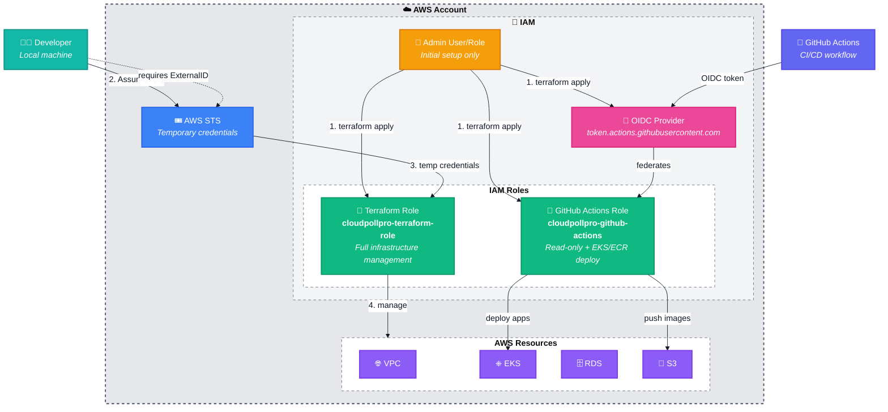
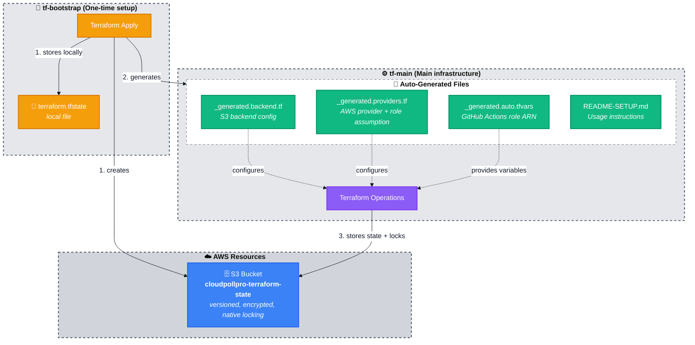

# Terraform Bootstrap - CloudPollPro

One-time setup to create the AWS foundation for the CloudPollPro project.

## Summary

The bootstrap module provisions the foundational AWS infrastructure required before deploying the main CloudPollPro resources. It establishes secure state management, IAM roles with least-privilege access, and CI/CD integration for GitHub Actions.

**Key Components:**
- **State Management**: S3 bucket with native state locking (encrypted, versioned)
- **IAM Role**: Dedicated role with AssumeRole pattern (no static credentials, temporary tokens)
- **GitHub OIDC**: Federated authentication for CI/CD pipelines (credential-less deployments)
- **Auto-Generation**: Creates configuration files for tf-main project with proper backend and provider setup

**Security Model:**
- No static access keys anywhere
- Temporary credentials via AssumeRole (12-hour expiration)
- External ID validation for role assumption
- CloudTrail audit logging of all actions
- Scoped permissions with least-privilege principle

**Why Bootstrap First:**
This is a one-time setup that must run before `tf-main`. It creates the S3 backend and IAM role that `tf-main` depends on. Bootstrap state remains local (backup the state file), while all subsequent Terraform projects use remote state.

## Architecture Overview

### 1. IAM Security & Access Control

This diagram shows the IAM role assumption pattern and GitHub Actions integration.



### 2. State Management & File Generation

This diagram shows how Terraform state is stored and configuration files are generated.



**Color Legend:**
- 🟢 **Users**: Developer and CI/CD
- 🟡 **Admin**: Initial bootstrap user
- 🟢 **IAM Roles**: Terraform and GitHub Actions roles
- 🔵 **STS**: Temporary credential service
- 🟣 **Resources**: AWS infrastructure
- 🟣 **OIDC**: GitHub federation
- 🟡 **Bootstrap**: One-time setup
- 🔵 **State Backend**: S3 with native locking
- 🟢 **Generated Files**: Auto-created configuration
- 🟣 **tf-main**: Main Terraform project

## Components

### 1. State Backend (`state-backend.tf`)

**S3 Bucket for Remote State with Native Locking**

- **Name**: `cloudpollpro-terraform-state-<account-id>`
- **Versioning**: Enabled (protects against accidental deletions)
- **Encryption**: AES256 server-side encryption
- **Public Access**: Blocked (all 4 settings enabled)
- **Lifecycle**: Prevent destroy disabled for dev (enable in production)
- **State Locking**: Native S3 locking (no DynamoDB required)

**Why**: Terraform now supports native S3 state locking without requiring a separate DynamoDB table. This simplifies infrastructure and reduces costs while maintaining safe, versioned state storage with automatic locking for team collaboration.

### 2. IAM Terraform Role (`iam.tf`)

**Dedicated Role for Infrastructure Management**

- **Name**: `cloudpollpro-terraform-role`
- **Path**: `/projects/`
- **AssumeRole Policy**: 
  - Principal: Your admin user/role
  - Condition: Requires external ID `cloudpollpro`
  - Provides: Temporary credentials (~12 hours)

**Attached Policies:**

- **S3 State Management**: Read/write access to state bucket
- **EC2 Full Access**: VPC, subnets, security groups, instances, etc.
- **EKS Full Access**: Cluster management, node groups, addons
- **RDS Full Access**: Database instances, subnet groups, parameter groups
- **ECR Full Access**: Repository management, image operations
- **IAM Limited**: Create/manage roles and policies (scoped to project)
- **Secrets Manager**: Create/manage secrets with `cloudpollpro-*` prefix
- **CloudWatch Logs**: Create log groups and streams

**Why**: Least-privilege access with audit trail, no static credentials, instant revocability.

### 3. GitHub OIDC Integration (`github-oidc.tf`)

**OpenID Connect Provider**

- **URL**: `https://token.actions.githubusercontent.com`
- **Audience**: `sts.amazonaws.com`
- **Thumbprints**: GitHub's certificate fingerprints (updated per AWS docs)

**GitHub Actions IAM Role**

- **Name**: `cloudpollpro-github-actions`
- **Path**: `/ci/`
- **AssumeRole Policy**:
  - Federated principal: GitHub OIDC provider
  - Condition: Repository must match `<owner>/<repo>`
  - No long-lived credentials needed

**Permissions:**

- **Read-only Terraform**: Can run `terraform plan` but not `apply`
- **EKS Deploy**: Update deployments, services, configmaps
- **ECR Push**: Upload container images
- **Secrets Manager**: Read secrets for K8s deployments

**Why**: Secure CI/CD without storing AWS credentials in GitHub. GitHub's OIDC token is exchanged for temporary AWS credentials on each workflow run.

### 4. Auto-Generated Files (`generated-files.tf`)

**Files Created in `../tf-main/`:**

1. **`_generated.backend.tf`**
   - Configures S3 backend with bucket name and region
   - Enables encryption and locking
   - Read-only (0444 permissions)

2. **`_generated.providers.tf`**
   - AWS provider configuration
   - Role assumption with external ID
   - Session naming: `terraform-<workspace>`
   - Default tags applied to all resources

3. **`_generated.auto.tfvars`** (if GitHub configured)
   - Contains GitHub Actions role ARN
   - Auto-loaded by Terraform

4. **`README-SETUP.md`**
   - Usage instructions for tf-main
   - Role assumption verification steps
   - Security notes

**Why**: Eliminates manual configuration errors and ensures consistent setup across team members.

## Deployment

### Prerequisites

- **AWS CLI** configured with admin credentials
- **Terraform** >= 1.0 (>= 1.9 for native S3 locking)
- **Admin permissions** to create IAM roles and S3 buckets

### Step 1: Configure Variables

Edit `terraform.tfvars` or use CLI flags:

```hcl
project_name       = "cloudpollpro"
aws_region         = "eu-west-3"
main_project_path  = "../tf-main"

# Optional: Enable GitHub Actions integration
github_repo_owner  = "your-github-username"
github_repo_name   = "cloudpollpro"
```

### Step 2: Bootstrap

```bash
cd infra/tf-bootstrap

# Initialize Terraform (downloads providers)
terraform init

# Review what will be created
terraform plan

# Create bootstrap resources
terraform apply

# Backup the state file (important!)
cp terraform.tfstate terraform.tfstate.backup
```

### Step 3: Verify

```bash
# Check S3 bucket created
aws s3 ls | grep cloudpollpro-terraform-state

# Verify bucket versioning and encryption
aws s3api get-bucket-versioning \
  --bucket cloudpollpro-terraform-state-$(aws sts get-caller-identity --query Account --output text)

aws s3api get-bucket-encryption \
  --bucket cloudpollpro-terraform-state-$(aws sts get-caller-identity --query Account --output text)

# Test role assumption
aws sts assume-role \
  --role-arn $(terraform output -raw role_arn) \
  --role-session-name test \
  --external-id cloudpollpro

# Verify generated files
ls -la ../tf-main/_generated*
cat ../tf-main/README-SETUP.md
```

### Step 4: Proceed to tf-main

```bash
cd ../tf-main

# Initialize with new backend
terraform init

# Verify state is remote
terraform state list  # Should show "(s3)" in output

# Continue with infrastructure deployment
terraform plan
terraform apply
```

## Security Best Practices

### ✅ Advantages of This Approach

1. **No Static Credentials**
   - Admin user doesn't need access keys
   - All operations use temporary STS tokens
   - Credentials expire automatically

2. **Complete Audit Trail**
   - CloudTrail logs show: WHO assumed the role AND WHAT they did
   - Easier to track infrastructure changes
   - Compliance-friendly

3. **Instant Revocation**
   - Modify role trust policy to revoke access immediately
   - No need to rotate access keys
   - Centralized access control

4. **Least Privilege**
   - Role has only necessary permissions
   - Scoped to project resources
   - Can be further restricted as needed

5. **Team Collaboration**
   - Multiple users can assume the same role
   - Consistent permissions across team
   - State locking prevents conflicts

### 🔒 External ID Security

The external ID (`cloudpollpro`) prevents the "confused deputy" problem:
- Ensures only authorized principals can assume the role
- Acts as a shared secret between you and AWS
- Required for every AssumeRole call

**Important**: Don't share the external ID publicly (though it's low-risk if leaked).

### 📋 Monitoring Role Usage

Track what actions are performed through the assumed role:

```bash
# View AssumeRole events
aws cloudtrail lookup-events \
  --lookup-attributes AttributeKey=EventName,AttributeValue=AssumeRole \
  --max-results 50

# View all actions by the role
aws cloudtrail lookup-events \
  --lookup-attributes AttributeKey=ResourceName,AttributeValue=cloudpollpro-terraform-role \
  --max-results 100
```

Or use AWS Console:
- **CloudTrail** → Event history → Filter by role name
- Shows both who assumed the role AND what actions were performed

## Outputs

After applying, bootstrap provides:

```bash
# Get role ARN for manual assumption
terraform output role_arn
# arn:aws:iam::058264398399:role/projects/cloudpollpro-terraform-role

# Get role name
terraform output role_name
# cloudpollpro-terraform-role

# Get external ID (marked sensitive)
terraform output external_id
# cloudpollpro

# Get GitHub Actions role (if configured)
terraform output github_actions_role_arn
# arn:aws:iam::058264398399:role/ci/cloudpollpro-github-actions
```

## Troubleshooting

### "AccessDenied" when assuming role

**Cause**: Your admin user lacks `sts:AssumeRole` permission.

**Solution**:
```bash
# Verify your identity
aws sts get-caller-identity

# Check if you can assume the role
aws iam get-role --role-name cloudpollpro-terraform-role

# Add AssumeRole permission to your user/role
```

### "Invalid external ID"

**Cause**: Wrong external ID provided or missing.

**Solution**:
```bash
# External ID must be: cloudpollpro
aws sts assume-role \
  --role-arn <role-arn> \
  --role-session-name test \
  --external-id cloudpollpro  # Must match exactly
```

### State file corrupted or lost

**Cause**: Local state file deleted or corrupted.

**Solution**:
```bash
# Restore from backup
cp terraform.tfstate.backup terraform.tfstate

# Or import resources manually
terraform import aws_s3_bucket.terraform_state cloudpollpro-terraform-state-<account-id>
terraform import aws_iam_role.project_role cloudpollpro-terraform-role
```

### GitHub Actions can't authenticate

**Cause**: OIDC provider or role misconfigured.

**Solution**:
```bash
# Verify OIDC provider exists
aws iam list-open-id-connect-providers

# Check role trust policy
aws iam get-role --role-name cloudpollpro-github-actions

# Ensure repository condition matches: repo:<owner>/<repo>:*
```

## Important Notes

### ⚠️ Bootstrap State is Local

- Bootstrap state file stays in `infra/tf-bootstrap/terraform.tfstate`
- **BACKUP THIS FILE** - it's critical for managing bootstrap resources
- Consider storing backup in secure location (encrypted USB, 1Password, etc.)
- DO NOT commit to git (already in `.gitignore`)

### 🔄 Updating Bootstrap

To modify bootstrap resources:

```bash
cd infra/tf-bootstrap
terraform plan   # Review changes
terraform apply  # Apply changes

# Re-generate files for tf-main if needed
cd ../tf-main
terraform init -reconfigure
```

### 🗑️ Destroying Everything

To completely tear down (in order):

```bash
# 1. Destroy main infrastructure first
cd infra/tf-main
terraform destroy

# 2. Destroy bootstrap (removes state backend)
cd ../tf-bootstrap
terraform destroy

# Note: S3 bucket must be empty to delete
# Use force_destroy = true in state-backend.tf for dev environments
```

### 🌍 Region Consistency

Bootstrap and tf-main **MUST** use the same AWS region:
- State bucket is region-specific
- Role ARNs are region-agnostic but referenced resources aren't
- Verify `aws_region` matches in both `terraform.tfvars` files

## Next Steps

After bootstrap completes successfully:

1. ✅ **Verify** generated files in `../tf-main/`
2. ✅ **Read** `../tf-main/README-SETUP.md` for usage instructions
3. ✅ **Backup** `terraform.tfstate` file somewhere safe
4. ✅ **Proceed** to `../tf-main/` to deploy CloudPollPro infrastructure

See [../tf-main/README.md](../tf-main/README.md) for infrastructure deployment guide.
