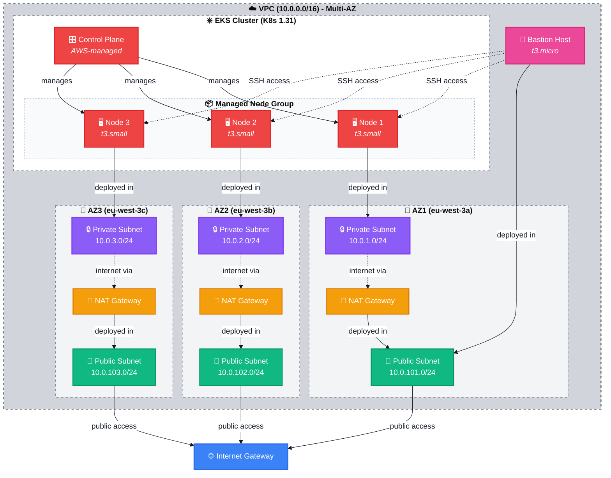
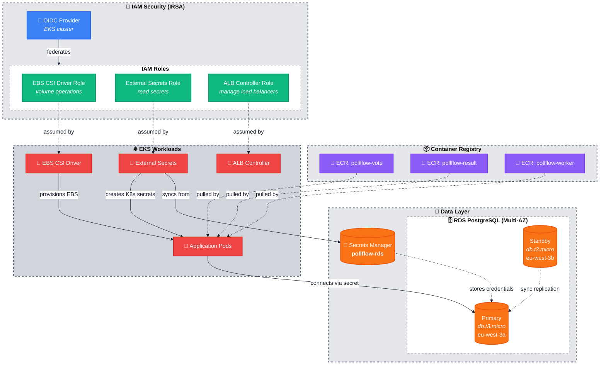

# Pollflow Infrastructure (Terraform)

This directory contains Terraform modules for provisioning Pollflow's AWS infrastructure.

## Summary

Pollflow's infrastructure is fully automated with Terraform, deploying a production-ready AWS environment with network isolation, high availability, and security best practices.

**Network & Compute:**
- **VPC**: Multi-AZ VPC (10.0.0.0/16) with 3 public and 3 private subnets across availability zones
- **EKS Cluster**: Kubernetes 1.31 with managed node groups (t3.small, 1-3 nodes) in private subnets
- **Bastion Host**: t3.micro jump server in public subnet for secure access
- **NAT Gateway**: Enables private subnet internet access for updates and container pulls

**Data & Security:**
- **RDS PostgreSQL**: Multi-AZ db.t3.micro (16.3) with automatic backups and encryption at rest
- **ECR**: Private container registries for vote, result, and worker images
- **Secrets Manager**: Secure storage for RDS credentials, synced to Kubernetes via External Secrets Operator
- **IAM Roles**: IRSA (IAM Roles for Service Accounts) for EBS CSI Driver, External Secrets, and AWS Load Balancer Controller

**Deployment Model:**
- Remote state stored in S3 with DynamoDB locking
- Role assumption for secure API access (no static credentials)
- Modular design with clear separation of concerns

## Architecture Overview

### 1. Network & Compute Layer

This diagram shows the VPC structure, EKS cluster, and network connectivity.



### 2. Data & Security Layer

This diagram shows data storage, container registries, and IAM security configurations.



**Color Legend:**
- 🔵 **Network/VPC**: VPC components and internet gateway
- 🟢 **Public**: Public subnets with direct internet access
- 🟣 **Private**: Private subnets (EKS nodes, RDS)
- 🔴 **Compute**: EKS control plane and worker nodes
- 🟡 **NAT**: NAT gateways for private subnet egress
- 🟣 **Bastion**: SSH jump host
- 🟠 **Data**: RDS and Secrets Manager
- 🟣 **Registry**: ECR repositories
- 🟢 **IAM**: Security roles and OIDC provider

## Terraform Modules

### 1. VPC (`vpc/`)

**Multi-AZ VPC with Public and Private Subnets**

- **CIDR**: 10.0.0.0/16
- **Public Subnets**: 3 subnets (10.0.101.0/24, 10.0.102.0/24, 10.0.103.0/24) across AZs
- **Private Subnets**: 3 subnets (10.0.1.0/24, 10.0.2.0/24, 10.0.3.0/24) across AZs
- **NAT Gateway**: Deployed in each public subnet for private subnet internet access
- **EKS Tags**: Automatic tagging for EKS subnet discovery

**Why**: Provides network isolation and high availability foundation for all AWS resources.

### 2. ECR (`ecr/`)

**Private Container Registries**

- **Repositories**: `pollflow-vote`, `pollflow-result`, `pollflow-worker`
- **Image Scanning**: Enabled on push
- **Encryption**: AES256 at rest
- **Lifecycle Policy**: Keeps last 10 images per repository
- **Immutable Tags**: Enabled for production safety

**Why**: Secure storage for application container images with automatic vulnerability scanning.

### 3. Bastion (`bastion/`)

**SSH Jump Host**

- **Instance Type**: t3.micro
- **Placement**: Public subnet (AZ1)
- **Access**: SSH from anywhere (configurable)
- **Purpose**: Secure access to private resources (EKS nodes, RDS)
- **Key Pair**: `pollflow-bastion-key` (stored in `.keys/`)

**Why**: Provides secure entry point to private network resources for troubleshooting.

### 4. EKS (`eks/`)

**Managed Kubernetes Cluster**

- **Version**: Kubernetes 1.31
- **Control Plane**: Multi-AZ, fully managed by AWS
- **Node Group**: 
  - Instance type: t3.small
  - Capacity: 1-3 nodes (desired: 2)
  - Placement: Private subnets only
  - AMI: Amazon Linux 2
- **Logging**: All control plane logs enabled (API, audit, authenticator, controller manager, scheduler)
- **OIDC Provider**: Enabled for IRSA (IAM Roles for Service Accounts)
- **Endpoints**: Public and private access enabled

**Why**: Provides production-ready Kubernetes platform with AWS integrations and managed upgrades.

### 5. EKS Addons (`eks-addons/`)

**Kubernetes Integrations and IAM Roles**

- **EBS CSI Driver**: EKS-managed addon for dynamic EBS volume provisioning
  - Service Account: `ebs-csi-controller-sa` (kube-system)
  - IAM Role: EC2 volume operations
  
- **External Secrets IAM Role**: Enables syncing AWS Secrets Manager to Kubernetes
  - Service Account: `external-secrets` (external-secrets-system)
  - IAM Role: Read secrets with prefix `pollflow-*`

- **AWS Load Balancer Controller IAM Role**: Provisions ALBs for Ingress resources
  - Service Account: `aws-load-balancer-controller` (kube-system)
  - IAM Role: ELBv2, EC2, WAF operations

**Why**: Provides secure, credential-free AWS API access for Kubernetes workloads using IRSA pattern.

### 6. RDS (`rds/`)

**PostgreSQL Database**

- **Engine**: PostgreSQL 16.3
- **Instance Class**: db.t3.micro
- **Multi-AZ**: Enabled (automatic failover)
- **Storage**: 
  - Initial: 20 GB gp3
  - Auto-scaling: Up to 100 GB
- **Backup**: 7-day retention, automated snapshots
- **Encryption**: At rest with AWS-managed keys
- **Credentials**: Stored in AWS Secrets Manager (`pollflow-rds`)
- **Access**: EKS nodes and bastion only (via security groups)
- **Monitoring**: CloudWatch logs for PostgreSQL and upgrades

**Why**: Managed, highly available database with automatic backups and secure credential management.

## Module Dependencies

```
1. VPC
   ├─> Creates network foundation
   └─> Outputs: vpc_id, subnet_ids

2. ECR (independent)
   └─> Outputs: repository_urls

3. Bastion
   ├─> Requires: VPC
   └─> Outputs: security_group_id

4. EKS
   ├─> Requires: VPC
   └─> Outputs: cluster_name, oidc_provider_arn, node_security_group_id

5. EKS Addons
   ├─> Requires: EKS (OIDC provider)
   └─> Creates: IAM roles for IRSA

6. RDS
   ├─> Requires: VPC, EKS, Bastion
   └─> Outputs: endpoint, secret_arn
```

## Deployment

### Prerequisites

- AWS CLI configured with admin credentials
- Terraform >= 1.0
- Permissions to assume role: `arn:aws:iam::058264398399:role/projects/pollflow-bootstrap-terraform-role`

### Initial Deployment

```bash
cd infra/tf-main

# Initialize Terraform (downloads providers and modules)
terraform init

# Review planned changes
terraform plan

# Apply infrastructure
terraform apply

# Outputs will display:
# - EKS cluster name and endpoint
# - ECR repository URLs
# - RDS endpoint
# - Bastion public IP
```

### Configure kubectl

```bash
# Update kubeconfig to access EKS cluster
aws eks update-kubeconfig \
  --region eu-west-3 \
  --name pollflow-eks

# Verify connection
kubectl get nodes
```

### Post-Deployment

After Terraform completes:

1. **Install Helm charts** (External Secrets Operator, AWS Load Balancer Controller)
2. **Deploy Kubernetes manifests** from `k8s/` directory
3. **Push container images** to ECR repositories
4. **Configure DNS** (if using custom domains)

## Security Notes

### Role Assumption
This project uses IAM role assumption instead of static access keys:
- **Backend Role**: `pollflow-bootstrap-terraform-role`
- **External ID**: `pollflow-bootstrap`
- **Benefits**: Temporary credentials, CloudTrail audit logging, instant revocation capability

See [README-SETUP.md](README-SETUP.md) for authentication details.

### Network Security
- EKS nodes in private subnets (no direct internet access)
- RDS in private subnets (accessible only from EKS and bastion)
- Security groups with least-privilege rules
- NAT Gateway for controlled egress

### Secrets Management
- Database passwords stored in AWS Secrets Manager (never in code)
- IRSA pattern eliminates need for AWS credentials in pods
- Container images scanned for vulnerabilities on push

## Cost Optimization

Current configuration optimized for development/learning:

- **EKS**: ~$73/month (control plane)
- **EC2**: ~$30/month (2x t3.small nodes)
- **RDS**: ~$15/month (db.t3.micro single-AZ)
- **NAT Gateway**: ~$33/month (1x gateway)
- **Total**: ~$150/month

**Savings tips:**
- Use single NAT Gateway instead of 3 (set `enable_nat_gateway = false` for 2 AZs)
- Use db.t3.micro single-AZ for dev (set `multi_az = false`)
- Stop EKS cluster when not in use (control plane still billed)

## Verification Commands

```bash
# Verify all resources created
terraform state list

# Check VPC
aws ec2 describe-vpcs --filters "Name=tag:Name,Values=pollflow-vpc"

# Check EKS cluster
aws eks describe-cluster --name pollflow-eks --region eu-west-3

# Check ECR repositories
aws ecr describe-repositories --region eu-west-3

# Check RDS instance
aws rds describe-db-instances --db-instance-identifier pollflow-postgres

# Check Secrets Manager
aws secretsmanager get-secret-value --secret-id pollflow-rds
```

## Troubleshooting

### "AccessDenied" errors
- Ensure your AWS credentials have `sts:AssumeRole` permission
- Verify external ID matches: `pollflow-bootstrap`

### Terraform state locked
- Check DynamoDB table: `pollflow-terraform-state-lock`
- Manually release lock if process crashed: `terraform force-unlock <lock-id>`

### EKS nodes not joining cluster
- Check security groups allow node-to-control-plane communication
- Verify IAM role has required EKS policies

### RDS connection issues
- Verify security groups allow traffic from EKS node security group
- Check RDS is in private subnets with correct subnet group

## Module Documentation

Each module has detailed documentation:
- [vpc/README.md](vpc/README.md) - VPC configuration
- [ecr/README.md](ecr/README.md) - Container registry
- [bastion/README.md](bastion/README.md) - Jump host
- [eks/README.md](eks/README.md) - Kubernetes cluster
- [eks-addons/README.md](eks-addons/README.md) - IRSA roles
- [rds/README.md](rds/README.md) - PostgreSQL database

## State Management

- **Backend**: S3 bucket `pollflow-terraform-state`
- **Locking**: DynamoDB table `pollflow-terraform-state-lock`
- **Region**: eu-west-3
- **Encryption**: AES256

All state files are encrypted at rest and access is controlled via IAM role assumption.
