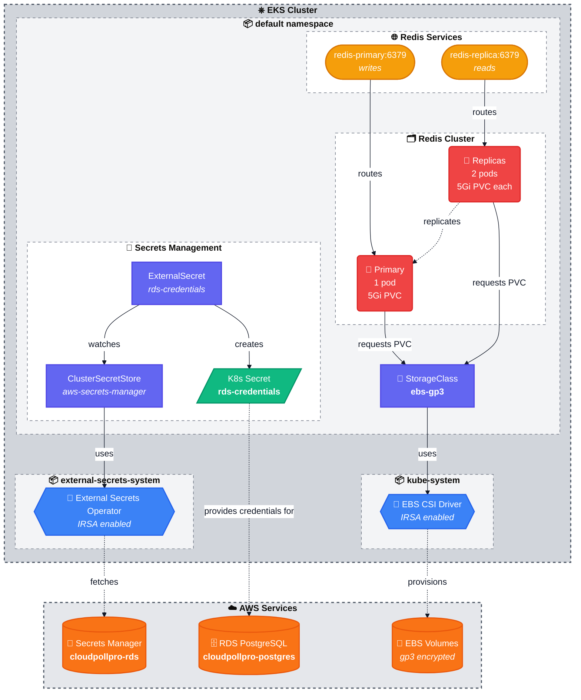
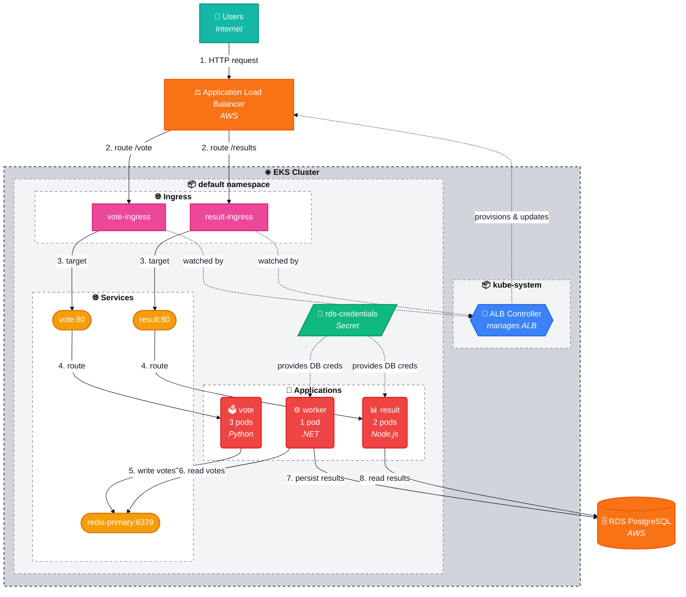

# Kubernetes Resources

This directory contains Kubernetes manifests for CloudPollPro's core services deployed on EKS.

## Summary

CloudPollPro is a microservices-based voting application running on Amazon EKS. The deployment consists of three application services (vote, worker, result) backed by Redis for real-time voting data and PostgreSQL (RDS) for persistent results storage.

**Key Infrastructure Components:**
- **Storage**: EBS CSI Driver for dynamic persistent volume provisioning (gp3 encrypted volumes)
- **Secrets Management**: External Secrets Operator syncing credentials from AWS Secrets Manager
- **Data Layer**: Redis cluster (primary-replica) for session/cache, RDS PostgreSQL for persistent storage
- **Ingress**: AWS Load Balancer Controller provisioning internet-facing ALBs for public access

**Application Stack:**
- **vote**: Python/Flask frontend (3 replicas) - users cast votes
- **worker**: .NET Core background processor (1 replica) - consumes votes from Redis and persists to PostgreSQL
- **result**: Node.js dashboard (2 replicas) - displays real-time results from PostgreSQL

All components follow cloud-native patterns with proper health checks, resource limits, rolling updates, and IRSA-based AWS authentication.

## Architecture Overview

### 1. Infrastructure & Data Layer

This diagram shows the foundational components: storage, data services, and secrets management.



### 2. Application & Traffic Flow

This diagram shows how user requests flow through the application stack.



**Color Legend:**
- 🟠 **AWS Services**: Managed AWS resources (ALB, Secrets Manager, EBS, RDS)
- 🔵 **Operators**: Kubernetes controllers (CSI Driver, External Secrets, ALB Controller)
- 🔴 **Workloads**: Application and database pods
- 🟡 **Services**: Kubernetes service discovery
- 🟢 **Secrets**: Sensitive credentials
- 🟣 **Config**: StorageClass, ClusterSecretStore, ExternalSecret
- 🟣 **Ingress**: Ingress resources
- 🟢 **Users**: External traffic

## Components

### 1. Storage (`storage/`)

**EBS CSI Driver Integration**
- **StorageClass**: `ebs-gp3` (default)
  - Provisioner: `ebs.csi.aws.com`
  - Volume type: gp3 (encrypted)
  - Binding mode: WaitForFirstConsumer (topology-aware)
  - Allows volume expansion

**Why**: Dynamic provisioning of persistent EBS volumes for stateful workloads.

### 2. Redis (`redis/`)

**Primary-Replica Architecture**
- **Primary StatefulSet**: 1 replica
  - Handles all write operations
  - AOF (Append-Only File) + RDB snapshots for persistence
  - 5Gi persistent volume per pod
  - Service: `redis-primary.default.svc.cluster.local:6379`

- **Replica StatefulSet**: 2 replicas
  - Handles read operations (load balancing)
  - Replicates from primary via stable DNS
  - 5Gi persistent volume per pod
  - Service: `redis-replica.default.svc.cluster.local:6379`

- **Headless Service**: `redis-headless`
  - Provides stable DNS for StatefulSet pods
  - Example: `redis-primary-0.redis-headless.default.svc.cluster.local`

**Configuration** (`configmap.yaml`):
- Persistence: AOF enabled + RDB snapshots (900s/1 key, 300s/10 keys, 60s/10000 keys)
- No authentication (dev environment)
- Max memory policy: noeviction

**Why**: Session storage, caching, real-time features for CloudPollPro application.

### 3. Secrets Management (`secrets/`)

**External Secrets Operator Integration**
- **ClusterSecretStore**: `aws-secrets-manager`
  - Provider: AWS Secrets Manager (eu-west-3)
  - Authentication: IRSA (IAM Roles for Service Accounts)
  - Scope: Cluster-wide, usable from any namespace

- **ExternalSecret**: `rds-credentials`
  - Source: `cloudpollpro-rds-*` in AWS Secrets Manager
  - Target: Kubernetes Secret `rds-credentials`
  - Refresh interval: 1 hour
  - Synced fields: username, password, host, port, dbname

**Why**: Secure credential management without storing secrets in git. Automatic sync from AWS Secrets Manager to Kubernetes.

### 4. Applications (`apps/`)

**CloudPollPro Microservices**

- **vote** (`apps/vote/`)
  - **Deployment**: 3 replicas with pod anti-affinity across zones
  - **Image**: `058264398399.dkr.ecr.eu-west-3.amazonaws.com/cloudpollpro-vote:latest`
  - **Language**: Python/Flask
  - **Purpose**: Frontend for voting (Cats vs Dogs)
  - **Connections**: Writes votes to `redis-primary:6379`
  - **Service**: ClusterIP on port 80
  - **Resources**: 256Mi memory, 200m CPU requests
  - **Strategy**: RollingUpdate (maxSurge:1, maxUnavailable:0)

- **worker** (`apps/worker/`)
  - **Deployment**: 1 replica
  - **Image**: `058264398399.dkr.ecr.eu-west-3.amazonaws.com/cloudpollpro-worker:latest`
  - **Language**: .NET Core
  - **Purpose**: Background processor consuming votes from Redis and persisting to PostgreSQL
  - **Connections**: 
    - Reads from `redis-primary:6379`
    - Writes to RDS PostgreSQL (via `rds-credentials` secret)
  - **Strategy**: RollingUpdate (maxSurge:1, maxUnavailable:0)

- **result** (`apps/result/`)
  - **Deployment**: 2 replicas
  - **Image**: `058264398399.dkr.ecr.eu-west-3.amazonaws.com/cloudpollpro-result:latest`
  - **Language**: Node.js
  - **Purpose**: Real-time results dashboard
  - **Connections**: Reads from RDS PostgreSQL (via `rds-credentials` secret)
  - **Service**: ClusterIP on port 80
  - **Environment**: Uses `PG_HOST`, `PG_PORT`, `PG_USER`, `PG_PASSWORD` from secret
  - **Strategy**: RollingUpdate (maxSurge:1, maxUnavailable:0)

**Why**: Core application services implementing the voting workflow: vote collection → processing → results display.

### 5. Ingress (`ingress/`)

**AWS Load Balancer Controller Integration**

- **vote-ingress** (`ingress/vote-ingress.yaml`)
  - **IngressClass**: `alb`
  - **Scheme**: internet-facing
  - **Target Type**: ip (direct pod routing)
  - **Backend**: `vote` service on port 80
  - **Health Checks**: `/health` endpoint (15s interval, 5s timeout, 2/2 threshold)
  - **Listener**: HTTP port 80

- **result-ingress** (`ingress/result-ingress.yaml`)
  - **IngressClass**: `alb`
  - **Scheme**: internet-facing
  - **Target Type**: ip (direct pod routing)
  - **Backend**: `result` service on port 80
  - **Health Checks**: `/health` endpoint (15s interval, 5s timeout, 2/2 threshold)
  - **Listener**: HTTP port 80

**Why**: Expose vote and result services to the internet via AWS Application Load Balancer. ALB Controller automatically provisions and manages ALBs based on Ingress resources.

## Resource Dependencies

```
1. EBS CSI Driver (Terraform-managed EKS addon)
   └─> StorageClass created

2. StorageClass ready
   └─> Redis StatefulSets deployed
       └─> PVCs provisioned
           └─> EBS volumes attached

3. External Secrets Operator (Helm-installed)
   └─> IAM role created (Terraform)
       └─> ClusterSecretStore configured
           └─> ExternalSecret syncs
               └─> Kubernetes Secret created

4. AWS Load Balancer Controller (Helm-installed)
   └─> IAM role created (Terraform)
       └─> Watches Ingress resources

5. Application Stack (depends on above)
   ├─> Redis Primary/Replica ready
   ├─> RDS credentials synced
   ├─> vote Deployment → Service → Ingress → ALB
   ├─> result Deployment → Service → Ingress → ALB
   └─> worker Deployment (connects to Redis + RDS)
```

## Deployed Services

| Service | Type | Endpoint | Purpose |
|---------|------|----------|---------|
| `vote` | ClusterIP | `vote.default.svc.cluster.local:80` | Vote frontend service |
| `result` | ClusterIP | `result.default.svc.cluster.local:80` | Results dashboard service |
| `redis-primary` | ClusterIP | `redis-primary.default.svc.cluster.local:6379` | Redis write operations |
| `redis-replica` | ClusterIP | `redis-replica.default.svc.cluster.local:6379` | Redis read operations |
| `redis-headless` | Headless | `redis-primary-0.redis-headless.default.svc.cluster.local:6379` | StatefulSet stable DNS |

## Secrets Available

| Secret | Namespace | Fields | Source |
|--------|-----------|--------|--------|
| `rds-credentials` | default | username, password, host, port, dbname | AWS Secrets Manager |

## Verification Commands

```bash
# Check storage
kubectl get storageclass
kubectl get pvc

# Check Redis
kubectl get pods -l app=redis
kubectl get svc -l app=redis
kubectl exec -it redis-primary-0 -- redis-cli ping
kubectl exec -it redis-primary-0 -- redis-cli INFO replication

# Check secrets
kubectl get clustersecretstore
kubectl get externalsecret
kubectl get secret rds-credentials
kubectl get secret rds-credentials -o jsonpath='{.data.host}' | base64 -d

# Check External Secrets Operator
kubectl get pods -n external-secrets-system
kubectl get sa external-secrets -n external-secrets-system -o yaml | grep role-arn

# Check applications
kubectl get deployments
kubectl get pods -l app=vote
kubectl get pods -l app=worker
kubectl get pods -l app=result
kubectl get svc vote result
kubectl logs -l app=vote --tail=20
kubectl logs -l app=worker --tail=20
kubectl logs -l app=result --tail=20

# Check ingress and ALB
kubectl get ingress
kubectl describe ingress vote-ingress
kubectl describe ingress result-ingress
kubectl get pods -n kube-system -l app.kubernetes.io/name=aws-load-balancer-controller

# Get ALB endpoints
kubectl get ingress vote-ingress -o jsonpath='{.status.loadBalancer.ingress[0].hostname}'
kubectl get ingress result-ingress -o jsonpath='{.status.loadBalancer.ingress[0].hostname}'
```

## Future Additions

This directory will expand to include:
- **Phase 5**: Monitoring stack (Prometheus, Grafana, custom dashboards)
- **Phase 6**: Advanced features (HPA, custom metrics, service mesh)

## Usage in Application Code

### Connecting to Redis (Primary for writes)
```yaml
env:
  - name: REDIS_HOST
    value: "redis-primary.default.svc.cluster.local"
  - name: REDIS_PORT
    value: "6379"
```

### Connecting to Redis (Replica for reads)
```yaml
env:
  - name: REDIS_REPLICA_HOST
    value: "redis-replica.default.svc.cluster.local"
  - name: REDIS_REPLICA_PORT
    value: "6379"
```

### Connecting to RDS PostgreSQL
```yaml
env:
  - name: DB_HOST
    valueFrom:
      secretKeyRef:
        name: rds-credentials
        key: host
  - name: DB_PORT
    valueFrom:
      secretKeyRef:
        name: rds-credentials
        key: port
  - name: DB_NAME
    valueFrom:
      secretKeyRef:
        name: rds-credentials
        key: dbname
  - name: DB_USER
    valueFrom:
      secretKeyRef:
        name: rds-credentials
        key: username
  - name: DB_PASSWORD
    valueFrom:
      secretKeyRef:
        name: rds-credentials
        key: password
```

## Notes

- All persistent data survives pod restarts/deletions
- Redis replicas are read-only; writes must go to primary
- EBS volumes are encrypted at rest (AWS-managed keys)
- Secrets are automatically refreshed every hour from AWS Secrets Manager
- StatefulSets provide stable network identities and ordered deployment/scaling
