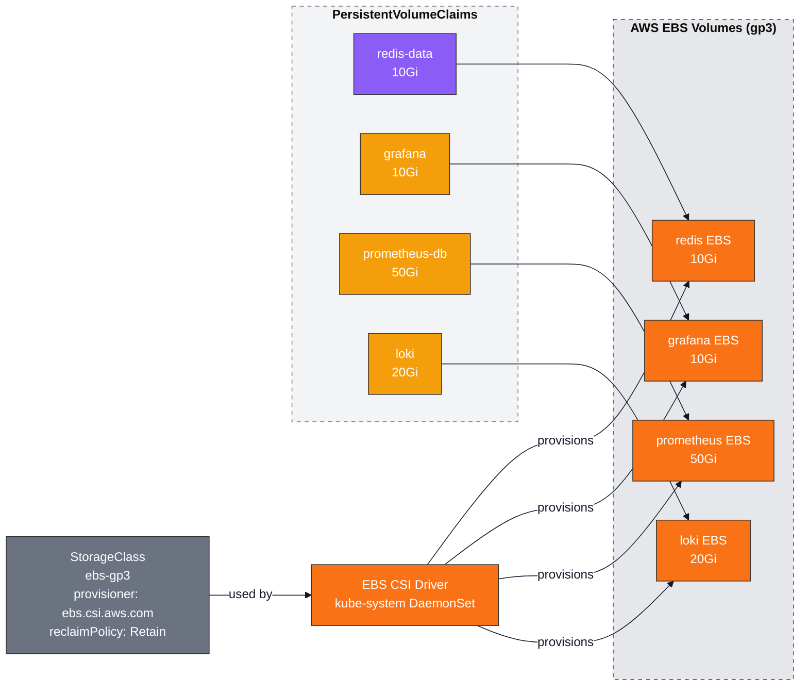

# Kubernetes Resource Diagrams

## Cluster Namespace Overview

```mermaid
%%{init: {'theme':'base', 'themeVariables': { 'primaryColor':'#e5e7eb','primaryTextColor':'#111827','primaryBorderColor':'#9ca3af','lineColor':'#111827','secondaryColor':'#d1d5db','tertiaryColor':'#f3f4f6','edgeLabelBackground':'#ffffff','mainBkg':'#f5f5f4','nodeBorder':'#9ca3af','background':'#f5f5f4','clusterBkg':'transparent'},'themeCSS':'.node rect, .node circle, .node ellipse, .node polygon, .node path { filter: none !important; box-shadow: none !important; } .cluster rect { filter: none !important; box-shadow: none !important; } svg { background-color: #f5f5f4 !important; } .cluster-label { background-color: #ffffff !important; padding: 6px 12px !important; border-radius: 4px !important; font-size: 16px !important; font-weight: 700 !important; box-shadow: 0 1px 3px rgba(0,0,0,0.12) !important; border: 1px solid #d1d5db !important; } .edgePath, .edgePath path, .flowchart-link { z-index: 1 !important; }'}}%%

graph TB
    subgraph EKS["EKS Cluster (pollflow-cluster)"]
        subgraph Default["default namespace"]
            FEDeploy[Deployment\nfrontend]
            FESvc[Service\nfrontend :3000]
            PBDeploy[Deployment\npoll-broker]
            PBSvc[Service\npoll-broker :9090]
            RedisPrimary[StatefulSet\nredis-primary]
            RedisReplica[StatefulSet\nredis-replica]
            RedisSvc[Service\nredis :6379]
            ExtSecret[ExternalSecret\nrds-credentials]
            SecretStore[SecretStore\naws-secrets-manager]
            K8sSecret[Secret\nrds-credentials\nauto-synced]
            ConfigMap[ConfigMap\nredis-config]
        end

        subgraph Monitoring["monitoring namespace"]
            GrafanaDeploy[Deployment\ngrafana]
            PromSS[StatefulSet\nprometheus]
            LokiSS[StatefulSet\nloki]
            FluentBitDS[DaemonSet\nfluent-bit]
            PMFrontend[PodMonitor\nfrontend]
            PMBroker[PodMonitor\npoll-broker]
            GrafanaSvc[Service\ngrafana :80]
        end

        subgraph KubeSystem["kube-system"]
            EBSCSI[DaemonSet\nebs-csi-node]
            ALBCtrl[Deployment\naws-load-balancer-controller]
            ESO[Deployment\nexternal-secrets-operator]
        end

        subgraph Storage["Storage (cluster-wide)"]
            SC[StorageClass\nebs-gp3]
            PVCS[PersistentVolumeClaims\nredis / grafana /\nprometheus / loki]
        end

        subgraph Ingress["Ingress (ALB)"]
            FEIngress[Ingress\nvote.pollflow.io\n→ frontend :3000]
            GrafanaIngress[Ingress\ngrafana.pollflow.io\n→ grafana :80]
        end
    end

    ExtSecret -->|reads from| SecretStore
    SecretStore -->|AWS SDK| SM[(Secrets Manager)]
    ExtSecret -->|creates/syncs| K8sSecret
    K8sSecret -->|envFrom| FEDeploy
    K8sSecret -->|envFrom| PBDeploy
    FEDeploy -->|selector| FESvc
    PBDeploy -->|selector| PBSvc
    FESvc --> FEIngress
    GrafanaSvc --> GrafanaIngress
    ConfigMap -->|configures| RedisPrimary

    style EKS fill:#d1d5db,stroke:#4b5563,stroke-width:2px,stroke-dasharray: 5 5
    style Default fill:#f3f4f6,stroke:#6b7280,stroke-width:1px,stroke-dasharray: 5 5
    style Monitoring fill:#f3f4f6,stroke:#6b7280,stroke-width:1px,stroke-dasharray: 5 5
    style KubeSystem fill:#f3f4f6,stroke:#6b7280,stroke-width:1px,stroke-dasharray: 5 5
    style Storage fill:#ffffff,stroke:#9ca3af,stroke-width:1px,stroke-dasharray: 5 5
    style Ingress fill:#ffffff,stroke:#9ca3af,stroke-width:1px,stroke-dasharray: 5 5

    style FEDeploy fill:#3B82F6,stroke:#333,color:#fff
    style FESvc fill:#6366F1,stroke:#333,color:#fff
    style PBDeploy fill:#3B82F6,stroke:#333,color:#fff
    style PBSvc fill:#6366F1,stroke:#333,color:#fff
    style RedisPrimary fill:#8B5CF6,stroke:#333,color:#fff
    style RedisReplica fill:#8B5CF6,stroke:#333,color:#fff
    style RedisSvc fill:#6366F1,stroke:#333,color:#fff
    style ExtSecret fill:#EF4444,stroke:#333,color:#fff
    style SecretStore fill:#EF4444,stroke:#333,color:#fff
    style K8sSecret fill:#EF4444,stroke:#333,color:#fff
    style ConfigMap fill:#6B7280,stroke:#333,color:#fff
    style GrafanaDeploy fill:#F59E0B,stroke:#333,color:#fff
    style PromSS fill:#F59E0B,stroke:#333,color:#fff
    style LokiSS fill:#F59E0B,stroke:#333,color:#fff
    style FluentBitDS fill:#F59E0B,stroke:#333,color:#fff
    style PMFrontend fill:#6B7280,stroke:#333,color:#fff
    style PMBroker fill:#6B7280,stroke:#333,color:#fff
    style GrafanaSvc fill:#6366F1,stroke:#333,color:#fff
    style EBSCSI fill:#F97316,stroke:#333,color:#fff
    style ALBCtrl fill:#F97316,stroke:#333,color:#fff
    style ESO fill:#F97316,stroke:#333,color:#fff
    style SC fill:#6B7280,stroke:#333,color:#fff
    style PVCS fill:#6B7280,stroke:#333,color:#fff
    style FEIngress fill:#F97316,stroke:#333,color:#fff
    style GrafanaIngress fill:#F97316,stroke:#333,color:#fff
    style SM fill:#EF4444,stroke:#333,color:#fff
```



## Secrets Flow: AWS → Kubernetes → Pods

```mermaid
%%{init: {'theme':'base', 'themeVariables': { 'primaryColor':'#e5e7eb','primaryTextColor':'#111827','primaryBorderColor':'#9ca3af','lineColor':'#111827','secondaryColor':'#d1d5db','tertiaryColor':'#f3f4f6','edgeLabelBackground':'#ffffff','mainBkg':'#f5f5f4','nodeBorder':'#9ca3af','background':'#f5f5f4','clusterBkg':'transparent'},'themeCSS':'.node rect, .node circle, .node ellipse, .node polygon, .node path { filter: none !important; box-shadow: none !important; } .cluster rect { filter: none !important; box-shadow: none !important; } svg { background-color: #f5f5f4 !important; } .cluster-label { background-color: #ffffff !important; padding: 6px 12px !important; border-radius: 4px !important; font-size: 16px !important; font-weight: 700 !important; box-shadow: 0 1px 3px rgba(0,0,0,0.12) !important; border: 1px solid #d1d5db !important; } .edgePath, .edgePath path, .flowchart-link { z-index: 1 !important; }'}}%%

flowchart LR
    subgraph AWS["AWS"]
        SM[(Secrets Manager\npollflow/rds-credentials\n{ host, port, user, pass, db })]
        IRSARole[/IRSA Role\nexternal-secrets/]
    end

    subgraph K8s["Kubernetes"]
        subgraph KubeSystem["kube-system"]
            ESO[external-secrets\noperator pod]
        end

        subgraph Default["default"]
            SS[SecretStore\napiVersion: external-secrets.io/v1beta1\nprovider: aws secretsmanager]
            ES[ExternalSecret\nrds-credentials\nrefreshInterval: 1h]
            Secret[Secret\nrds-credentials\nDB_HOST, DB_PORT,\nDB_USER, DB_PASS, DB_NAME]

            FE[Frontend Pod\nenvFrom: secretRef]
            PB[poll-broker Pod\nenvFrom: secretRef]
        end
    end

    IRSARole -->|IRSA bound to| ESO
    ESO -->|watches| ES
    ES -->|references| SS
    SS -->|GetSecretValue| SM
    SM -->|secret JSON| SS
    SS --> ES
    ES -->|creates/syncs| Secret
    Secret -->|env vars| FE
    Secret -->|env vars| PB

    style AWS fill:#e5e7eb,stroke:#4b5563,stroke-dasharray: 5 5
    style K8s fill:#d1d5db,stroke:#4b5563,stroke-dasharray: 5 5
    style KubeSystem fill:#f3f4f6,stroke:#6b7280,stroke-dasharray: 5 5
    style Default fill:#f3f4f6,stroke:#6b7280,stroke-dasharray: 5 5

    style SM fill:#EF4444,stroke:#333,color:#fff
    style IRSARole fill:#EF4444,stroke:#333,color:#fff
    style ESO fill:#F97316,stroke:#333,color:#fff
    style SS fill:#EF4444,stroke:#333,color:#fff
    style ES fill:#EF4444,stroke:#333,color:#fff
    style Secret fill:#EF4444,stroke:#333,color:#fff
    style FE fill:#3B82F6,stroke:#333,color:#fff
    style PB fill:#3B82F6,stroke:#333,color:#fff
```

## Storage: PersistentVolumes


