# Monitoring Diagrams

## Component Architecture

```mermaid
%%{init: {'theme':'base', 'themeVariables': { 'primaryColor':'#e5e7eb','primaryTextColor':'#111827','primaryBorderColor':'#9ca3af','lineColor':'#111827','secondaryColor':'#d1d5db','tertiaryColor':'#f3f4f6','edgeLabelBackground':'#ffffff','mainBkg':'#f5f5f4','nodeBorder':'#9ca3af','background':'#f5f5f4','clusterBkg':'transparent'},'themeCSS':'.node rect, .node circle, .node ellipse, .node polygon, .node path { filter: none !important; box-shadow: none !important; } .cluster rect { filter: none !important; box-shadow: none !important; } svg { background-color: #f5f5f4 !important; } .cluster-label { background-color: #ffffff !important; padding: 6px 12px !important; border-radius: 4px !important; font-size: 16px !important; font-weight: 700 !important; box-shadow: 0 1px 3px rgba(0,0,0,0.12) !important; border: 1px solid #d1d5db !important; } .edgePath, .edgePath path, .flowchart-link { z-index: 1 !important; }'}}%%

graph TB
    subgraph AWS["AWS"]
        ALB[/ALB/]
        CW[(CloudWatch\nRDS + Lambda metrics)]
        IRSA[/IRSA Role\npollflow-grafana/]

        subgraph EKS["EKS Cluster"]
            subgraph Default["default namespace"]
                FE[Frontend Pod\n:3000/metrics]
                PB[poll-broker Pod\n:9090/metrics]
            end

            subgraph Monitoring["monitoring namespace"]
                subgraph KPS["kube-prometheus-stack v85.1.0"]
                    Prom[(Prometheus\n50Gi EBS)]
                    Graf[Grafana 13\n10Gi EBS]
                    Alert[Alertmanager]
                    NE[node-exporter\nDaemonSet]
                    KSM[kube-state-metrics]
                    PO{{Prometheus Operator}}
                end

                subgraph Loki["loki-stack v2.10.3"]
                    LokiDB[(Loki\n20Gi EBS)]
                    FB[fluent-bit\nDaemonSet]
                end

                PMFrontend[/PodMonitor\nfrontend/]
                PMBroker[/PodMonitor\npoll-broker/]
            end
        end
    end

    User([Browser]) --> ALB
    ALB --> Graf

    FB -->|ship logs| LokiDB
    NE -->|node metrics| Prom
    KSM -->|k8s object metrics| Prom
    PO -->|reconciles| PMFrontend
    PO -->|reconciles| PMBroker
    PMFrontend -->|scrape :3000/metrics| FE
    PMBroker -->|scrape :9090/metrics| PB
    Prom -->|store metrics| Prom
    Graf -->|PromQL| Prom
    Graf -->|LogQL| LokiDB
    Graf -->|CloudWatch API| CW
    Graf -->|assume role| IRSA

    style AWS fill:#e5e7eb,stroke:#4b5563,stroke-width:2px,stroke-dasharray: 5 5
    style EKS fill:#d1d5db,stroke:#4b5563,stroke-width:2px,stroke-dasharray: 5 5
    style Default fill:#f3f4f6,stroke:#6b7280,stroke-width:1px,stroke-dasharray: 5 5
    style Monitoring fill:#f3f4f6,stroke:#6b7280,stroke-width:1px,stroke-dasharray: 5 5
    style KPS fill:#ffffff,stroke:#9ca3af,stroke-width:1px,stroke-dasharray: 5 5
    style Loki fill:#ffffff,stroke:#9ca3af,stroke-width:1px,stroke-dasharray: 5 5

    style ALB fill:#F97316,stroke:#333,stroke-width:1px,color:#fff
    style CW fill:#F97316,stroke:#333,stroke-width:1px,color:#fff
    style IRSA fill:#EF4444,stroke:#333,stroke-width:1px,color:#fff
    style FE fill:#3B82F6,stroke:#333,stroke-width:1px,color:#fff
    style PB fill:#3B82F6,stroke:#333,stroke-width:1px,color:#fff
    style Prom fill:#F59E0B,stroke:#333,stroke-width:1px,color:#fff
    style Graf fill:#F59E0B,stroke:#333,stroke-width:1px,color:#fff
    style Alert fill:#F59E0B,stroke:#333,stroke-width:1px,color:#fff
    style NE fill:#F59E0B,stroke:#333,stroke-width:1px,color:#fff
    style KSM fill:#F59E0B,stroke:#333,stroke-width:1px,color:#fff
    style PO fill:#F59E0B,stroke:#333,stroke-width:1px,color:#fff
    style LokiDB fill:#F59E0B,stroke:#333,stroke-width:1px,color:#fff
    style FB fill:#F59E0B,stroke:#333,stroke-width:1px,color:#fff
    style PMFrontend fill:#6B7280,stroke:#333,stroke-width:1px,color:#fff
    style PMBroker fill:#6B7280,stroke:#333,stroke-width:1px,color:#fff
    style User fill:#10B981,stroke:#333,stroke-width:1px,color:#fff
```



## Log Collection Flow

```mermaid
%%{init: {'theme':'base', 'themeVariables': { 'primaryColor':'#e5e7eb','primaryTextColor':'#111827','primaryBorderColor':'#9ca3af','lineColor':'#111827','secondaryColor':'#d1d5db','tertiaryColor':'#f3f4f6','edgeLabelBackground':'#ffffff','mainBkg':'#f5f5f4','nodeBorder':'#9ca3af','background':'#f5f5f4','clusterBkg':'transparent'},'themeCSS':'.node rect, .node circle, .node ellipse, .node polygon, .node path { filter: none !important; box-shadow: none !important; } .cluster rect { filter: none !important; box-shadow: none !important; } svg { background-color: #f5f5f4 !important; } .cluster-label { background-color: #ffffff !important; padding: 6px 12px !important; border-radius: 4px !important; font-size: 16px !important; font-weight: 700 !important; box-shadow: 0 1px 3px rgba(0,0,0,0.12) !important; border: 1px solid #d1d5db !important; } .edgePath, .edgePath path, .flowchart-link { z-index: 1 !important; }'}}%%

flowchart LR
    subgraph Pod["Pod (any namespace)"]
        App[App process\nstdout/stderr]
    end

    subgraph Node["Node filesystem"]
        CRI[Container runtime\n/var/log/containers/]
    end

    subgraph FB["fluent-bit DaemonSet"]
        Tail[tail input\n/var/log/containers/*.log]
        K8sMeta[kubernetes filter\nadd labels: app, namespace,\ncontainer, node]
        LokiOut[loki output]
    end

    subgraph Loki["Loki"]
        Ingest[HTTP ingest\n:3100]
        Store[(Log store\n20Gi EBS)]
    end

    subgraph Grafana["Grafana"]
        Query[LogQL query]
        Dashboard[Dashboard panel]
    end

    App -->|write| CRI
    CRI --> Tail
    Tail --> K8sMeta
    K8sMeta --> LokiOut
    LokiOut -->|HTTP POST| Ingest
    Ingest --> Store
    Query -->|read| Store
    Query --> Dashboard

    style Pod fill:#f3f4f6,stroke:#6b7280,stroke-width:1px,stroke-dasharray: 5 5
    style Node fill:#e5e7eb,stroke:#4b5563,stroke-width:1px,stroke-dasharray: 5 5
    style FB fill:#f3f4f6,stroke:#6b7280,stroke-width:1px,stroke-dasharray: 5 5
    style Loki fill:#f3f4f6,stroke:#6b7280,stroke-width:1px,stroke-dasharray: 5 5
    style Grafana fill:#f3f4f6,stroke:#6b7280,stroke-width:1px,stroke-dasharray: 5 5

    style App fill:#3B82F6,stroke:#333,color:#fff
    style CRI fill:#6B7280,stroke:#333,color:#fff
    style Tail fill:#F59E0B,stroke:#333,color:#fff
    style K8sMeta fill:#F59E0B,stroke:#333,color:#fff
    style LokiOut fill:#F59E0B,stroke:#333,color:#fff
    style Ingest fill:#F59E0B,stroke:#333,color:#fff
    style Store fill:#8B5CF6,stroke:#333,color:#fff
    style Query fill:#F59E0B,stroke:#333,color:#fff
    style Dashboard fill:#F59E0B,stroke:#333,color:#fff
```



## Grafana Dashboards

```mermaid
%%{init: {'theme':'base', 'themeVariables': { 'primaryColor':'#e5e7eb','primaryTextColor':'#111827','primaryBorderColor':'#9ca3af','lineColor':'#111827','secondaryColor':'#d1d5db','tertiaryColor':'#f3f4f6','edgeLabelBackground':'#ffffff','mainBkg':'#f5f5f4','nodeBorder':'#9ca3af','background':'#f5f5f4','clusterBkg':'transparent'},'themeCSS':'.node rect, .node circle, .node ellipse, .node polygon, .node path { filter: none !important; box-shadow: none !important; } .cluster rect { filter: none !important; box-shadow: none !important; } svg { background-color: #f5f5f4 !important; } .cluster-label { background-color: #ffffff !important; padding: 6px 12px !important; border-radius: 4px !important; font-size: 16px !important; font-weight: 700 !important; box-shadow: 0 1px 3px rgba(0,0,0,0.12) !important; border: 1px solid #d1d5db !important; } .edgePath, .edgePath path, .flowchart-link { z-index: 1 !important; }'}}%%

graph LR
    subgraph PollFlow["PollFlow folder (ConfigMap sidecar)"]
        SH[Service Health\npollflow-service-health\nPrometheus: CPU, memory,\nGC, event loop lag]
        LG[Logs\npollflow-logs\nLoki: log rates,\nerror rates, raw logs]
        AC[Application Activity\npollflow-activity\nLoki: vote_recorded,\npoll lifecycle events]
    end

    subgraph Sources["Datasources"]
        Prom[(Prometheus)]
        Loki[(Loki)]
        CW[(CloudWatch)]
    end

    SH -->|PromQL| Prom
    LG -->|LogQL| Loki
    AC -->|LogQL\n|= backtick matching| Loki

    style PollFlow fill:#f3f4f6,stroke:#6b7280,stroke-width:1px,stroke-dasharray: 5 5
    style Sources fill:#f3f4f6,stroke:#6b7280,stroke-width:1px,stroke-dasharray: 5 5

    style SH fill:#F59E0B,stroke:#333,color:#fff
    style LG fill:#F59E0B,stroke:#333,color:#fff
    style AC fill:#F59E0B,stroke:#333,color:#fff
    style Prom fill:#F97316,stroke:#333,color:#fff
    style Loki fill:#F97316,stroke:#333,color:#fff
    style CW fill:#F97316,stroke:#333,color:#fff
```
