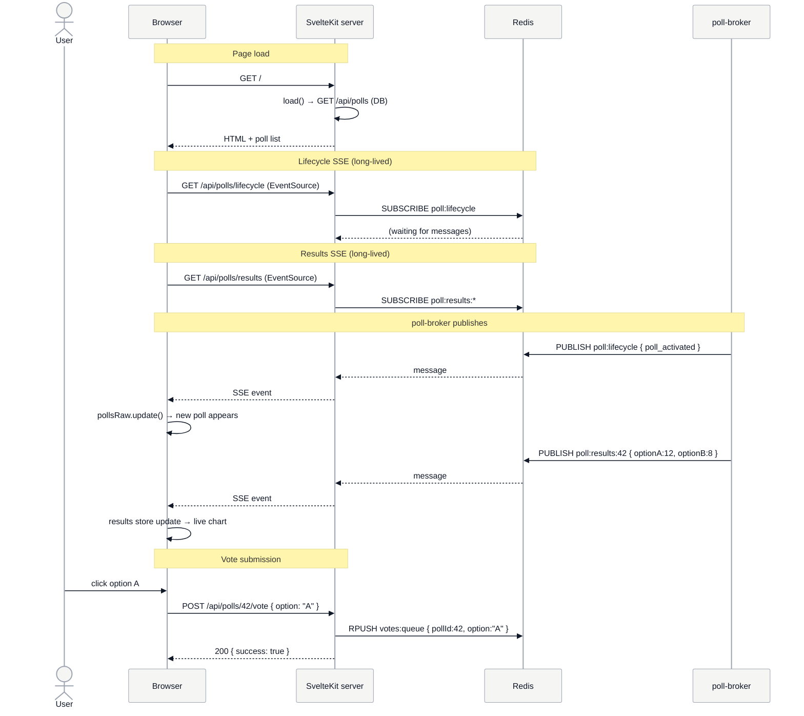

# Frontend Service Diagrams

## Route & Module Architecture

```mermaid
%%{init: {'theme':'base', 'themeVariables': { 'primaryColor':'#e5e7eb','primaryTextColor':'#111827','primaryBorderColor':'#9ca3af','lineColor':'#111827','secondaryColor':'#d1d5db','tertiaryColor':'#f3f4f6','edgeLabelBackground':'#ffffff','mainBkg':'#f5f5f4','nodeBorder':'#9ca3af','background':'#f5f5f4','clusterBkg':'transparent'},'themeCSS':'.node rect, .node circle, .node ellipse, .node polygon, .node path { filter: none !important; box-shadow: none !important; } .cluster rect { filter: none !important; box-shadow: none !important; } svg { background-color: #f5f5f4 !important; } .cluster-label { background-color: #ffffff !important; padding: 6px 12px !important; border-radius: 4px !important; font-size: 16px !important; font-weight: 700 !important; box-shadow: 0 1px 3px rgba(0,0,0,0.12) !important; border: 1px solid #d1d5db !important; } .edgePath, .edgePath path, .flowchart-link { z-index: 1 !important; }'}}%%

graph TB
    subgraph Frontend["Frontend (SvelteKit)"]
        subgraph Routes["src/routes/"]
            Root[/ +page.svelte\n+page.ts]
            VoteAPI[/api/polls/:id/vote\n+server.ts POST]
            PollsAPI[/api/polls\n+server.ts GET]
            PollAPI[/api/polls/:id\n+server.ts GET]
            LifecycleAPI[/api/polls/lifecycle\n+server.ts GET SSE]
            ResultsAPI[/api/polls/results\n+server.ts GET SSE]
            MetricsAPI[/metrics\n+server.ts GET]
        end

        subgraph Stores["src/lib/stores/"]
            PollLifecycleStore[pollLifecycle.ts\nSSE client\npollsRaw writable]
            PollResultsStore[pollResults.ts\nSSE client\nresults writable]
        end

        subgraph Libs["src/lib/server/"]
            DBLib[db.ts\nPostgreSQL pool\npg + node-postgres]
            RedisLib[redis.ts\nioredis client]
            LoggerLib[logger.ts\npino JSON logger]
            MetricsLib[metrics.ts\nprom-client\ncollectDefaultMetrics]
        end
    end

    Redis[(Redis)]
    PG[(PostgreSQL)]
    Prometheus[(Prometheus)]

    Root -->|load data| PollsAPI
    Root -->|subscribe| PollLifecycleStore
    Root -->|subscribe| PollResultsStore
    PollLifecycleStore -->|EventSource| LifecycleAPI
    PollResultsStore -->|EventSource| ResultsAPI

    VoteAPI --> RedisLib
    PollsAPI --> DBLib
    PollAPI --> DBLib
    LifecycleAPI --> RedisLib
    ResultsAPI --> RedisLib
    MetricsAPI --> MetricsLib

    DBLib <--> PG
    RedisLib <--> Redis
    Prometheus -->|scrape| MetricsAPI

    style Frontend fill:#d1d5db,stroke:#4b5563,stroke-width:2px,stroke-dasharray: 5 5
    style Routes fill:#f3f4f6,stroke:#6b7280,stroke-width:1px,stroke-dasharray: 5 5
    style Stores fill:#f3f4f6,stroke:#6b7280,stroke-width:1px,stroke-dasharray: 5 5
    style Libs fill:#f3f4f6,stroke:#6b7280,stroke-width:1px,stroke-dasharray: 5 5

    style Root fill:#3B82F6,stroke:#333,color:#fff
    style VoteAPI fill:#3B82F6,stroke:#333,color:#fff
    style PollsAPI fill:#3B82F6,stroke:#333,color:#fff
    style PollAPI fill:#3B82F6,stroke:#333,color:#fff
    style LifecycleAPI fill:#3B82F6,stroke:#333,color:#fff
    style ResultsAPI fill:#3B82F6,stroke:#333,color:#fff
    style MetricsAPI fill:#F59E0B,stroke:#333,color:#fff
    style PollLifecycleStore fill:#6366F1,stroke:#333,color:#fff
    style PollResultsStore fill:#6366F1,stroke:#333,color:#fff
    style DBLib fill:#8B5CF6,stroke:#333,color:#fff
    style RedisLib fill:#8B5CF6,stroke:#333,color:#fff
    style LoggerLib fill:#6B7280,stroke:#333,color:#fff
    style MetricsLib fill:#F59E0B,stroke:#333,color:#fff
    style Redis fill:#8B5CF6,stroke:#333,color:#fff
    style PG fill:#8B5CF6,stroke:#333,color:#fff
    style Prometheus fill:#F59E0B,stroke:#333,color:#fff
```

## Real-time Data Flow (SSE)



## Vote Submission Detail

```mermaid
%%{init: {'theme':'base', 'themeVariables': { 'primaryColor':'#e5e7eb','primaryTextColor':'#111827','primaryBorderColor':'#9ca3af','lineColor':'#111827','secondaryColor':'#d1d5db','tertiaryColor':'#f3f4f6','edgeLabelBackground':'#ffffff','mainBkg':'#f5f5f4','nodeBorder':'#9ca3af','background':'#f5f5f4','clusterBkg':'transparent'},'themeCSS':'.node rect, .node circle, .node ellipse, .node polygon, .node path { filter: none !important; box-shadow: none !important; } .cluster rect { filter: none !important; box-shadow: none !important; } svg { background-color: #f5f5f4 !important; } .cluster-label { background-color: #ffffff !important; padding: 6px 12px !important; border-radius: 4px !important; font-size: 16px !important; font-weight: 700 !important; box-shadow: 0 1px 3px rgba(0,0,0,0.12) !important; border: 1px solid #d1d5db !important; } .edgePath, .edgePath path, .flowchart-link { z-index: 1 !important; }'}}%%

flowchart TD
    Click([User clicks vote option])
    POST[POST /api/polls/:id/vote\nbody: { option }]
    ParseReq[Parse request body\nextract poll_id from params]
    ValidateOpt{valid option\nA or B?}
    CheckPoll[DB: GET /api/polls/:id\nverify poll is active]
    ActiveCheck{poll active?}
    PushRedis[Redis: RPUSH votes:queue\n{ pollId, option, userIp }]
    Resp200[200 { success: true }]
    Resp400[400 { error: invalid option }]
    Resp409[409 { error: poll not active }]
    Resp500[500 { error: internal }]

    Click --> POST
    POST --> ParseReq
    ParseReq --> ValidateOpt
    ValidateOpt -->|invalid| Resp400
    ValidateOpt -->|valid| CheckPoll
    CheckPoll --> ActiveCheck
    ActiveCheck -->|not active| Resp409
    ActiveCheck -->|active| PushRedis
    PushRedis -->|ok| Resp200
    PushRedis -->|error| Resp500

    style Click fill:#10B981,stroke:#333,color:#fff
    style POST fill:#3B82F6,stroke:#333,color:#fff
    style ParseReq fill:#3B82F6,stroke:#333,color:#fff
    style ValidateOpt fill:#F97316,stroke:#333,color:#fff
    style CheckPoll fill:#8B5CF6,stroke:#333,color:#fff
    style ActiveCheck fill:#F97316,stroke:#333,color:#fff
    style PushRedis fill:#8B5CF6,stroke:#333,color:#fff
    style Resp200 fill:#10B981,stroke:#333,color:#fff
    style Resp400 fill:#EF4444,stroke:#333,color:#fff
    style Resp409 fill:#EF4444,stroke:#333,color:#fff
    style Resp500 fill:#EF4444,stroke:#333,color:#fff
```
