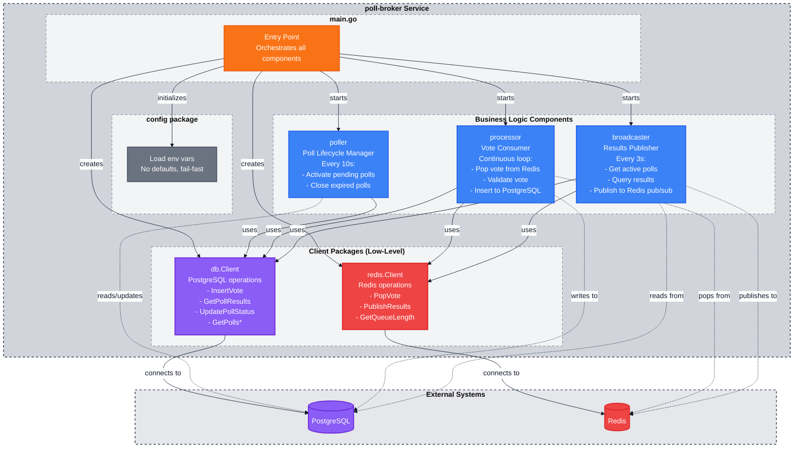

# Poll Broker

Background service that manages poll lifecycle and vote processing for PollFlow.

## Purpose

The poll-broker is a bidirectional bridge between Redis and PostgreSQL:

- **Redis → PostgreSQL**: Consumes votes from Redis queue and persists to database
- **PostgreSQL → Redis**: Broadcasts live vote results via Redis pub/sub
- **PostgreSQL**: Manages poll state transitions (pending → active → closed)

## Components

- **Poller** - Poll lifecycle manager (checks every 10s for status changes)
- **Processor** - Vote queue consumer (continuous processing)
- **Broadcaster** - Results publisher (broadcasts every 3s via pub/sub)

## Architecture



**Key Concepts:**
- **Client packages** (db, redis) = Low-level tools for single operations
- **Business components** (poller, processor, broadcaster) = Workers that orchestrate multiple operations
- **main.go** = Entry point that initializes and coordinates all components

## Tech Stack

- Go 1.22+
- PostgreSQL driver: pgx/v5
- Redis client: go-redis/v9

## Environment Variables

```bash
DB_HOST=localhost
DB_PORT=5432
DB_NAME=pollflow_development
DB_USER=pollflow_developer
DB_PASSWORD=developer_password

REDIS_HOST=localhost
REDIS_PORT=6379
```

## Running Locally

```bash
# Install dependencies
go mod download

# Run service
go run cmd/poll-broker/main.go
```

## Docker

```bash
# Build
docker build -t poll-broker:latest .

# Run
docker run --env-file .development.env poll-broker:latest
```
