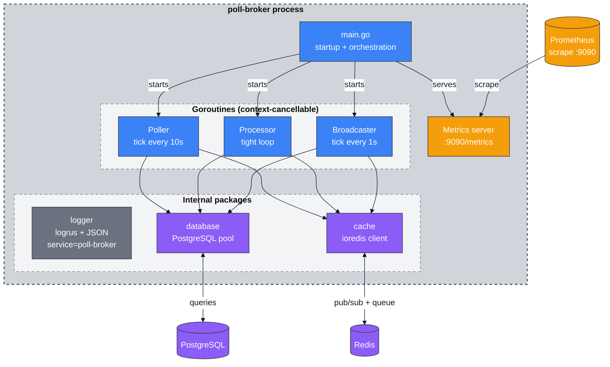
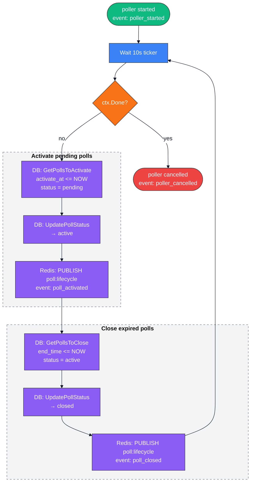
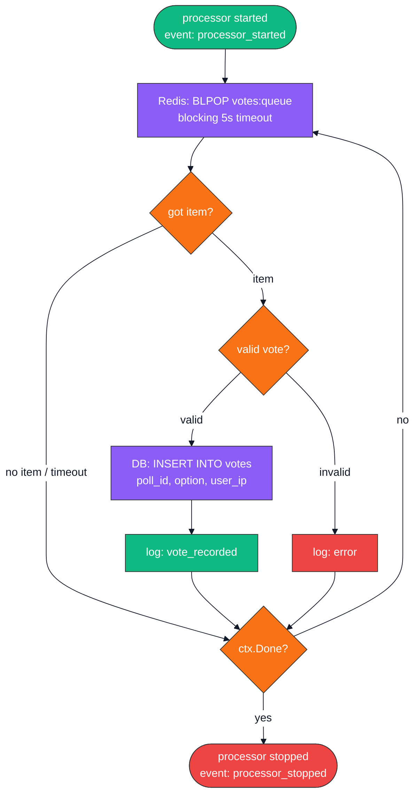

# poll-broker Service Diagrams

## Internal Architecture



## Poller Goroutine Flow



## Processor Goroutine Flow



## Broadcaster Goroutine Flow

```mermaid
%%{init: {'theme':'base', 'themeVariables': { 'primaryColor':'#e5e7eb','primaryTextColor':'#111827','primaryBorderColor':'#9ca3af','lineColor':'#111827','secondaryColor':'#d1d5db','tertiaryColor':'#f3f4f6','edgeLabelBackground':'#ffffff','mainBkg':'#f5f5f4','nodeBorder':'#9ca3af','background':'#f5f5f4','clusterBkg':'transparent'},'themeCSS':'.node rect, .node circle, .node ellipse, .node polygon, .node path { filter: none !important; box-shadow: none !important; } .cluster rect { filter: none !important; box-shadow: none !important; } svg { background-color: #f5f5f4 !important; } .cluster-label { background-color: #ffffff !important; padding: 6px 12px !important; border-radius: 4px !important; font-size: 16px !important; font-weight: 700 !important; box-shadow: 0 1px 3px rgba(0,0,0,0.12) !important; border: 1px solid #d1d5db !important; } .edgePath, .edgePath path, .flowchart-link { z-index: 1 !important; }'}}%%

flowchart TD
    Start([broadcaster started\nevent: broadcaster_started])
    Tick[Wait 1s ticker]
    Cancel{ctx.Done?}
    GetPolls[DB: GetActivePolls]
    ErrPolls{error?}
    LogPollsErr[log: broadcast_active_polls_error]
    ForEach[for each active poll]
    GetResults[DB: GetPollResults poll_id]
    Publish[Redis: PUBLISH poll:results\n{ poll_id, optionA, optionB, total }]
    LogPub[log: broadcast_poll_success]
    LogFail[log: broadcast_poll_failed]
    End([broadcaster stopped\nevent: broadcaster_stopped])

    Start --> Tick
    Tick --> Cancel
    Cancel -->|yes| End
    Cancel -->|no| GetPolls
    GetPolls --> ErrPolls
    ErrPolls -->|error| LogPollsErr
    ErrPolls -->|ok| ForEach
    LogPollsErr --> Tick
    ForEach --> GetResults
    GetResults --> Publish
    Publish --> LogPub
    LogPub --> ForEach
    Publish -->|error| LogFail
    LogFail --> ForEach
    ForEach -->|done| Tick

    style Start fill:#10B981,stroke:#333,color:#fff
    style End fill:#EF4444,stroke:#333,color:#fff
    style Tick fill:#3B82F6,stroke:#333,color:#fff
    style Cancel fill:#F97316,stroke:#333,color:#fff
    style GetPolls fill:#8B5CF6,stroke:#333,color:#fff
    style ErrPolls fill:#F97316,stroke:#333,color:#fff
    style LogPollsErr fill:#EF4444,stroke:#333,color:#fff
    style ForEach fill:#3B82F6,stroke:#333,color:#fff
    style GetResults fill:#8B5CF6,stroke:#333,color:#fff
    style Publish fill:#8B5CF6,stroke:#333,color:#fff
    style LogPub fill:#10B981,stroke:#333,color:#fff
    style LogFail fill:#EF4444,stroke:#333,color:#fff
```
