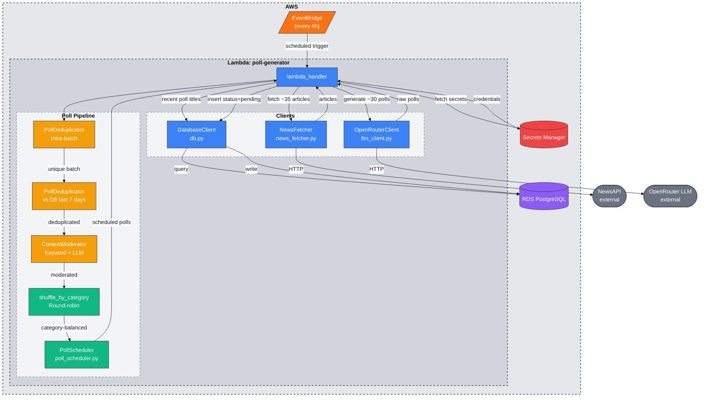
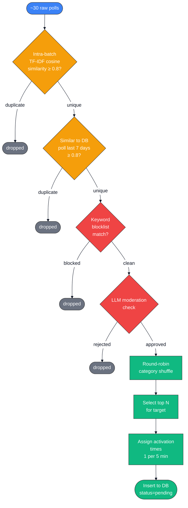

# Lambda Flow Diagrams

## Lambda Invocation & Orchestration

```mermaid
%%{init: {'theme':'base', 'themeVariables': { 'primaryColor':'#e5e7eb','primaryTextColor':'#111827','primaryBorderColor':'#9ca3af','lineColor':'#111827','secondaryColor':'#d1d5db','tertiaryColor':'#f3f4f6','edgeLabelBackground':'#ffffff','mainBkg':'#f5f5f4','nodeBorder':'#9ca3af','background':'#f5f5f4','clusterBkg':'transparent'},'themeCSS':'.node rect, .node circle, .node ellipse, .node polygon, .node path { filter: none !important; box-shadow: none !important; } .cluster rect { filter: none !important; box-shadow: none !important; } svg { background-color: #f5f5f4 !important; } .cluster-label { background-color: #ffffff !important; padding: 6px 12px !important; border-radius: 4px !important; font-size: 16px !important; font-weight: 700 !important; box-shadow: 0 1px 3px rgba(0,0,0,0.12) !important; border: 1px solid #d1d5db !important; } .edgePath, .edgePath path, .flowchart-link { z-index: 1 !important; }'}}%%

graph TB
    subgraph AWS["AWS"]
        EB[/"EventBridge\n(every 4h)"/]
        SM[(Secrets Manager)]
        RDS[(RDS PostgreSQL)]

        subgraph Lambda["Lambda: poll-generator"]
            H[lambda_handler]

            subgraph Clients["Clients"]
                NF[NewsFetcher\nnews_fetcher.py]
                LLM[OpenRouterClient\nllm_client.py]
                DB[DatabaseClient\ndb.py]
            end

            subgraph Pipeline["Poll Pipeline"]
                QG1[PollDeduplicator\nIntra-batch]
                QG2[PollDeduplicator\nvs DB last 7 days]
                CM[ContentModerator\nKeyword + LLM]
                PS[PollScheduler\npoll_scheduler.py]
                SH[shuffle_by_category\nRound-robin]
            end
        end
    end

    NewsAPI([NewsAPI\nexternal])
    OpenRouter([OpenRouter LLM\nexternal])

    EB -->|scheduled trigger| H
    H -->|fetch secrets| SM
    SM -->|credentials| H
    H -->|fetch ~35 articles| NF
    NF -->|HTTP| NewsAPI
    NF -->|articles| H
    H -->|generate ~30 polls| LLM
    LLM -->|HTTP| OpenRouter
    LLM -->|raw polls| H
    H --> QG1
    QG1 -->|unique batch| QG2
    H -->|recent poll titles| DB
    DB -->|query| RDS
    QG2 -->|deduplicated| CM
    CM -->|moderated| SH
    SH -->|category-balanced| PS
    PS -->|scheduled polls| H
    H -->|insert status=pending| DB
    DB -->|write| RDS

    style AWS fill:#e5e7eb,stroke:#4b5563,stroke-width:2px,stroke-dasharray: 5 5
    style Lambda fill:#d1d5db,stroke:#4b5563,stroke-width:2px,stroke-dasharray: 5 5
    style Clients fill:#f3f4f6,stroke:#6b7280,stroke-width:1px,stroke-dasharray: 5 5
    style Pipeline fill:#f3f4f6,stroke:#6b7280,stroke-width:1px,stroke-dasharray: 5 5

    style EB fill:#F97316,stroke:#333,stroke-width:1px,color:#fff
    style SM fill:#EF4444,stroke:#333,stroke-width:1px,color:#fff
    style RDS fill:#8B5CF6,stroke:#333,stroke-width:1px,color:#fff
    style H fill:#3B82F6,stroke:#333,stroke-width:1px,color:#fff
    style NF fill:#3B82F6,stroke:#333,stroke-width:1px,color:#fff
    style LLM fill:#3B82F6,stroke:#333,stroke-width:1px,color:#fff
    style DB fill:#3B82F6,stroke:#333,stroke-width:1px,color:#fff
    style QG1 fill:#F59E0B,stroke:#333,stroke-width:1px,color:#fff
    style QG2 fill:#F59E0B,stroke:#333,stroke-width:1px,color:#fff
    style CM fill:#F59E0B,stroke:#333,stroke-width:1px,color:#fff
    style PS fill:#10B981,stroke:#333,stroke-width:1px,color:#fff
    style SH fill:#10B981,stroke:#333,stroke-width:1px,color:#fff
    style NewsAPI fill:#6B7280,stroke:#333,stroke-width:1px,color:#fff
    style OpenRouter fill:#6B7280,stroke:#333,stroke-width:1px,color:#fff
```

## Quality Gate Pipeline

```mermaid
%%{init: {'theme':'base', 'themeVariables': { 'primaryColor':'#e5e7eb','primaryTextColor':'#111827','primaryBorderColor':'#9ca3af','lineColor':'#111827','secondaryColor':'#d1d5db','tertiaryColor':'#f3f4f6','edgeLabelBackground':'#ffffff','mainBkg':'#f5f5f4','nodeBorder':'#9ca3af','background':'#f5f5f4','clusterBkg':'transparent'},'themeCSS':'.node rect, .node circle, .node ellipse, .node polygon, .node path { filter: none !important; box-shadow: none !important; } .cluster rect { filter: none !important; box-shadow: none !important; } svg { background-color: #f5f5f4 !important; } .cluster-label { background-color: #ffffff !important; padding: 6px 12px !important; border-radius: 4px !important; font-size: 16px !important; font-weight: 700 !important; box-shadow: 0 1px 3px rgba(0,0,0,0.12) !important; border: 1px solid #d1d5db !important; } .edgePath, .edgePath path, .flowchart-link { z-index: 1 !important; }'}}%%

flowchart TD
    A([~30 raw polls]) --> B{Intra-batch\nTF-IDF cosine\nsimilarity ≥ 0.8?}
    B -->|duplicate| DROP1([dropped])
    B -->|unique| C{Similar to DB\npoll last 7 days\n≥ 0.8?}
    C -->|duplicate| DROP2([dropped])
    C -->|unique| D{Keyword\nblocklist\nmatch?}
    D -->|blocked| DROP3([dropped])
    D -->|clean| E{LLM moderation\ncheck}
    E -->|rejected| DROP4([dropped])
    E -->|approved| F[Round-robin\ncategory shuffle]
    F --> G[Select top N\nfor target]
    G --> H[Assign activation\ntimes\n1 per 5 min]
    H --> I([Insert to DB\nstatus=pending])

    style A fill:#3B82F6,stroke:#333,color:#fff
    style I fill:#10B981,stroke:#333,color:#fff
    style B fill:#F59E0B,stroke:#333,color:#fff
    style C fill:#F59E0B,stroke:#333,color:#fff
    style D fill:#EF4444,stroke:#333,color:#fff
    style E fill:#EF4444,stroke:#333,color:#fff
    style F fill:#10B981,stroke:#333,color:#fff
    style G fill:#10B981,stroke:#333,color:#fff
    style H fill:#10B981,stroke:#333,color:#fff
    style DROP1 fill:#6B7280,stroke:#333,color:#fff
    style DROP2 fill:#6B7280,stroke:#333,color:#fff
    style DROP3 fill:#6B7280,stroke:#333,color:#fff
    style DROP4 fill:#6B7280,stroke:#333,color:#fff
```

## Poll Scheduling

```mermaid
%%{init: {'theme':'base', 'themeVariables': { 'primaryColor':'#e5e7eb','primaryTextColor':'#111827','primaryBorderColor':'#9ca3af','lineColor':'#111827','secondaryColor':'#d1d5db','tertiaryColor':'#f3f4f6','edgeLabelBackground':'#ffffff','mainBkg':'#f5f5f4','nodeBorder':'#9ca3af','background':'#f5f5f4','clusterBkg':'transparent'},'themeCSS':'.node rect, .node circle, .node ellipse, .node polygon, .node path { filter: none !important; box-shadow: none !important; } .cluster rect { filter: none !important; box-shadow: none !important; } svg { background-color: #f5f5f4 !important; } .cluster-label { background-color: #ffffff !important; padding: 6px 12px !important; border-radius: 4px !important; font-size: 16px !important; font-weight: 700 !important; box-shadow: 0 1px 3px rgba(0,0,0,0.12) !important; border: 1px solid #d1d5db !important; } .edgePath, .edgePath path, .flowchart-link { z-index: 1 !important; }'}}%%

gantt
    title Poll Activation Distribution (single Lambda run, 4h window)
    dateFormat HH:mm
    axisFormat %H:%M

    section Polls
    Poll 1  :00:00, 5m
    Poll 2  :00:05, 5m
    Poll 3  :00:10, 5m
    Poll 4  :00:15, 5m
    Poll 5  :00:20, 5m
    Poll 6  :00:25, 5m
    Poll 7  :00:30, 5m
    Poll 8  :00:35, 5m
    Poll 9  :00:40, 5m
    Poll 10 :00:45, 5m
    Poll 11 :00:50, 5m
    Poll 12 :00:55, 5m
    ...     :01:00, 180m
```
