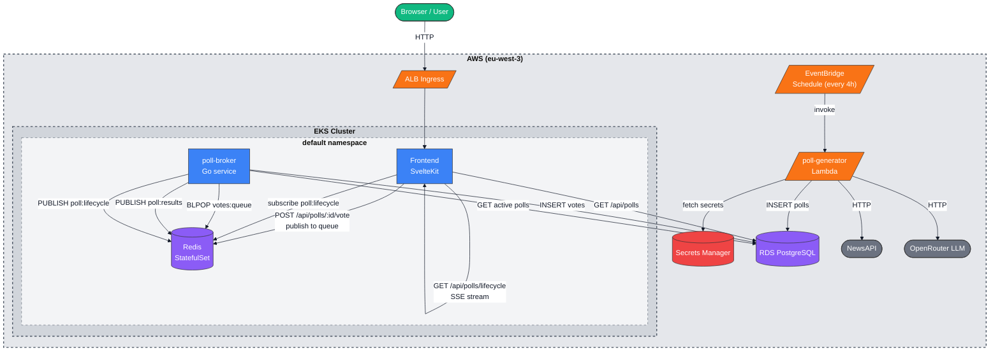
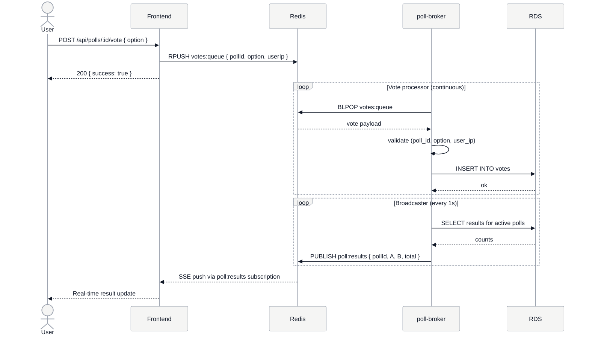
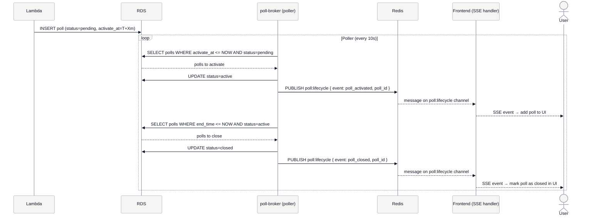

# Services Architecture Diagrams

## System Overview

```mermaid
%%{init: {'theme':'base', 'themeVariables': { 'primaryColor':'#e5e7eb','primaryTextColor':'#111827','primaryBorderColor':'#9ca3af','lineColor':'#111827','secondaryColor':'#d1d5db','tertiaryColor':'#f3f4f6','edgeLabelBackground':'#ffffff','mainBkg':'#f5f5f4','nodeBorder':'#9ca3af','background':'#f5f5f4','clusterBkg':'transparent'},'themeCSS':'.node rect, .node circle, .node ellipse, .node polygon, .node path { filter: none !important; box-shadow: none !important; } .cluster rect { filter: none !important; box-shadow: none !important; } svg { background-color: #f5f5f4 !important; } .cluster-label { background-color: #ffffff !important; padding: 6px 12px !important; border-radius: 4px !important; font-size: 16px !important; font-weight: 700 !important; box-shadow: 0 1px 3px rgba(0,0,0,0.12) !important; border: 1px solid #d1d5db !important; } .edgePath, .edgePath path, .flowchart-link { z-index: 1 !important; }'}}%%

graph TB
    User([Browser / User])

    subgraph AWS["AWS (eu-west-3)"]
        EB[/"EventBridge\nSchedule (every 4h)"/]
        SM[(Secrets Manager)]

        subgraph EKS["EKS Cluster"]
            subgraph Default["default namespace"]
                FE[Frontend\nSvelteKit]
                PB[poll-broker\nGo service]
                Redis[(Redis\nStatefulSet)]
            end
        end

        RDS[(RDS PostgreSQL)]
        Lambda[/poll-generator\nLambda/]
        NewsAPI([NewsAPI])
        OpenRouter([OpenRouter LLM])
        ALB[/ALB Ingress/]
    end

    User -->|HTTP| ALB
    ALB --> FE

    FE -->|GET /api/polls| RDS
    FE -->|POST /api/polls/:id/vote\npublish to queue| Redis
    FE -->|GET /api/polls/lifecycle\nSSE stream| FE
    FE -->|subscribe poll:lifecycle| Redis

    PB -->|BLPOP votes:queue| Redis
    PB -->|INSERT votes| RDS
    PB -->|GET active polls| RDS
    PB -->|PUBLISH poll:results| Redis
    PB -->|PUBLISH poll:lifecycle| Redis

    EB -->|invoke| Lambda
    Lambda -->|fetch secrets| SM
    Lambda -->|INSERT polls| RDS
    Lambda -->|HTTP| NewsAPI
    Lambda -->|HTTP| OpenRouter

    style AWS fill:#e5e7eb,stroke:#4b5563,stroke-width:2px,stroke-dasharray: 5 5
    style EKS fill:#d1d5db,stroke:#4b5563,stroke-width:2px,stroke-dasharray: 5 5
    style Default fill:#f3f4f6,stroke:#6b7280,stroke-width:1px,stroke-dasharray: 5 5

    style ALB fill:#F97316,stroke:#333,stroke-width:1px,color:#fff
    style EB fill:#F97316,stroke:#333,stroke-width:1px,color:#fff
    style SM fill:#EF4444,stroke:#333,stroke-width:1px,color:#fff
    style RDS fill:#8B5CF6,stroke:#333,stroke-width:1px,color:#fff
    style Redis fill:#8B5CF6,stroke:#333,stroke-width:1px,color:#fff
    style FE fill:#3B82F6,stroke:#333,stroke-width:1px,color:#fff
    style PB fill:#3B82F6,stroke:#333,stroke-width:1px,color:#fff
    style Lambda fill:#F97316,stroke:#333,stroke-width:1px,color:#fff
    style NewsAPI fill:#6B7280,stroke:#333,stroke-width:1px,color:#fff
    style OpenRouter fill:#6B7280,stroke:#333,stroke-width:1px,color:#fff
    style User fill:#10B981,stroke:#333,stroke-width:1px,color:#fff
```

## Vote Submission Flow

```mermaid
%%{init: {'theme':'base', 'themeVariables': { 'primaryColor':'#e5e7eb','primaryTextColor':'#111827','primaryBorderColor':'#9ca3af','lineColor':'#111827','secondaryColor':'#d1d5db','tertiaryColor':'#f3f4f6','edgeLabelBackground':'#ffffff','mainBkg':'#f5f5f4','nodeBorder':'#9ca3af','background':'#f5f5f4','clusterBkg':'transparent'},'themeCSS':'.node rect, .node circle, .node ellipse, .node polygon, .node path { filter: none !important; box-shadow: none !important; } .cluster rect { filter: none !important; box-shadow: none !important; } svg { background-color: #f5f5f4 !important; } .cluster-label { background-color: #ffffff !important; padding: 6px 12px !important; border-radius: 4px !important; font-size: 16px !important; font-weight: 700 !important; box-shadow: 0 1px 3px rgba(0,0,0,0.12) !important; border: 1px solid #d1d5db !important; } .edgePath, .edgePath path, .flowchart-link { z-index: 1 !important; }'}}%%

sequenceDiagram
    actor User
    participant FE as Frontend
    participant Redis
    participant PB as poll-broker
    participant RDS

    User->>FE: POST /api/polls/:id/vote { option }
    FE->>Redis: RPUSH votes:queue { pollId, option, userIp }
    FE-->>User: 200 { success: true }

    loop Vote processor (continuous)
        PB->>Redis: BLPOP votes:queue
        Redis-->>PB: vote payload
        PB->>PB: validate (poll_id, option, user_ip)
        PB->>RDS: INSERT INTO votes
        RDS-->>PB: ok
    end

    loop Broadcaster (every 1s)
        PB->>RDS: SELECT results for active polls
        RDS-->>PB: counts
        PB->>Redis: PUBLISH poll:results { pollId, A, B, total }
    end

    Redis-->>FE: SSE push via poll:results subscription
    FE-->>User: Real-time result update
```

## Real-time Poll Lifecycle Flow

```mermaid
%%{init: {'theme':'base', 'themeVariables': { 'primaryColor':'#e5e7eb','primaryTextColor':'#111827','primaryBorderColor':'#9ca3af','lineColor':'#111827','secondaryColor':'#d1d5db','tertiaryColor':'#f3f4f6','edgeLabelBackground':'#ffffff','mainBkg':'#f5f5f4','nodeBorder':'#9ca3af','background':'#f5f5f4','clusterBkg':'transparent'},'themeCSS':'.node rect, .node circle, .node ellipse, .node polygon, .node path { filter: none !important; box-shadow: none !important; } .cluster rect { filter: none !important; box-shadow: none !important; } svg { background-color: #f5f5f4 !important; } .cluster-label { background-color: #ffffff !important; padding: 6px 12px !important; border-radius: 4px !important; font-size: 16px !important; font-weight: 700 !important; box-shadow: 0 1px 3px rgba(0,0,0,0.12) !important; border: 1px solid #d1d5db !important; } .edgePath, .edgePath path, .flowchart-link { z-index: 1 !important; }'}}%%

sequenceDiagram
    participant Lambda
    participant RDS
    participant PB as poll-broker (poller)
    participant Redis
    participant FE as Frontend (SSE handler)
    actor User

    Lambda->>RDS: INSERT poll (status=pending, activate_at=T+Xm)

    loop Poller (every 10s)
        PB->>RDS: SELECT polls WHERE activate_at <= NOW AND status=pending
        RDS-->>PB: polls to activate
        PB->>RDS: UPDATE status=active
        PB->>Redis: PUBLISH poll:lifecycle { event: poll_activated, poll_id }
        Redis-->>FE: message on poll:lifecycle channel
        FE-->>User: SSE event → add poll to UI

        PB->>RDS: SELECT polls WHERE end_time <= NOW AND status=active
        RDS-->>PB: polls to close
        PB->>RDS: UPDATE status=closed
        PB->>Redis: PUBLISH poll:lifecycle { event: poll_closed, poll_id }
        Redis-->>FE: message on poll:lifecycle channel
        FE-->>User: SSE event → mark poll as closed in UI
    end
```
